---
## Front matter
lang: ru-RU
title: Структура научной презентации
subtitle: Простейший шаблон
author:
  - Павличенко Родион Андреевич
institute:
  - Российский университет дружбы народов, Москва, Россия
  - Объединённый институт ядерных исследований, Дубна, Россия
date: 01 января 1970

## i18n babel
babel-lang: russian
babel-otherlangs: english

## Formatting pdf
toc: false
toc-title: Содержание
slide_level: 2
aspectratio: 169
section-titles: true
theme: metropolis
header-includes:
 - \metroset{progressbar=frametitle,sectionpage=progressbar,numbering=fraction}
---

# Информация

## Докладчик

:::::::::::::: {.columns align=center}
::: {.column width="70%"}

  * Павличенко Родион Андреевич
  * Группа НПИбд-02-24
  * Студент
  * Российский университет дружбы народов
  * [1132246838@pfur.ru](mailto:1132246838@pfur.ru)

## Цели и задачи

Приобретение практических навыков установки операционной системы на виртуальную машину, настройки минимально необходимых для дальнейшей работы сервисов

# Задание

Полная настройка и установка OC Linux

                                                      

# Выполнение лабораторной работы

## Создаем новую виртуальную машину, указываем имя, выбираем диск,производим настройку

:::::::::::::: {.columns align=center}
::: {.column width="70%"}

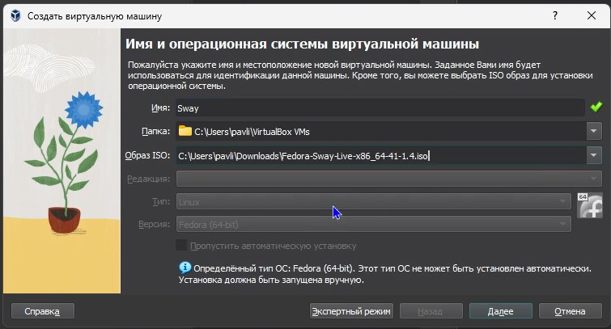{#fig:001 width=70%}

:::
::::::::::::::

## Настраиваем Sway, создаем учетную запись

:::::::::::::: {.columns align=center}
::: {.column width="70%"}

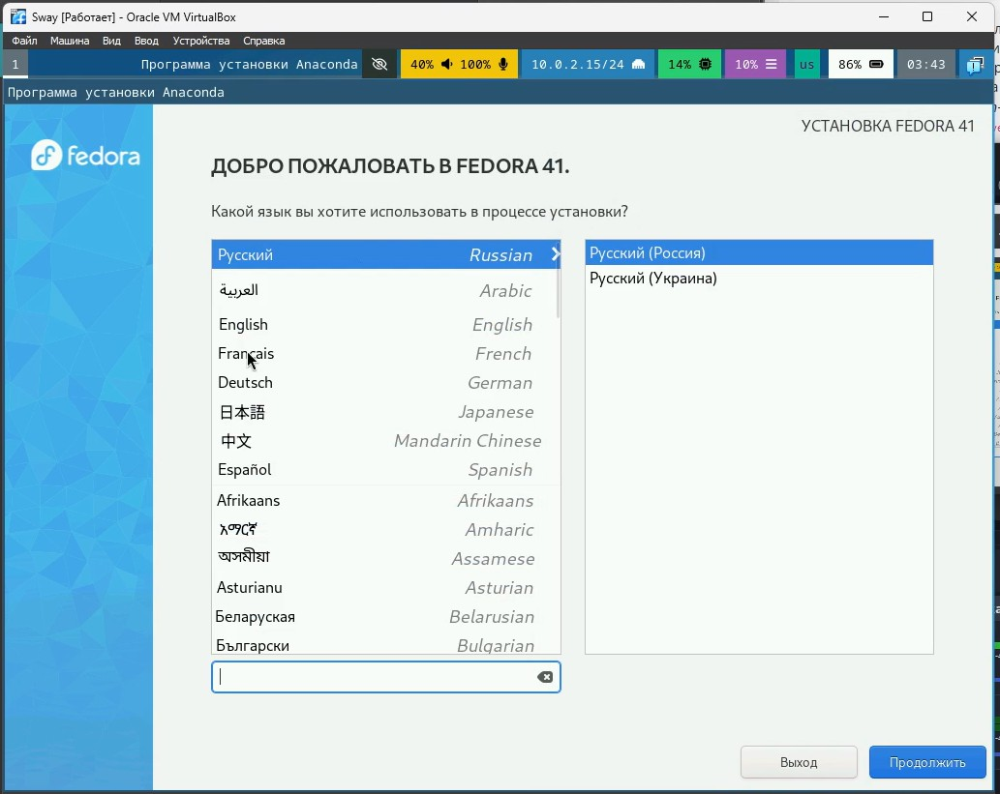{#fig:001 width=70%}

:::
::::::::::::::

## Включаем режим супер-пользователя, устанавливаем средства разработки

:::::::::::::: {.columns align=center}
::: {.column width="70%"}

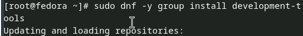{#fig:001 width=70%}

:::
::::::::::::::

## Обновляем пакеты

:::::::::::::: {.columns align=center}
::: {.column width="70%"}

{#fig:001 width=70%}

:::
::::::::::::::

## Устанавливаем tmux для удобства работы в консоли

:::::::::::::: {.columns align=center}
::: {.column width="70%"}

{#fig:001 width=70%}

:::
::::::::::::::

## Устанавливаем автоматическое обновление

:::::::::::::: {.columns align=center}
::: {.column width="70%"}

{#fig:001 width=70%}
:::
::::::::::::::

##Запускаем таймер

:::::::::::::: {.columns align=center}
::: {.column width="70%"}

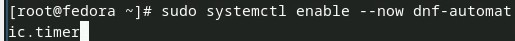{#fig:001 width=70%}

:::
::::::::::::::

## Отключаем SELinux , при помощи nano редактируем файл и перезапускаем систему

:::::::::::::: {.columns align=center}
::: {.column width="70%"}

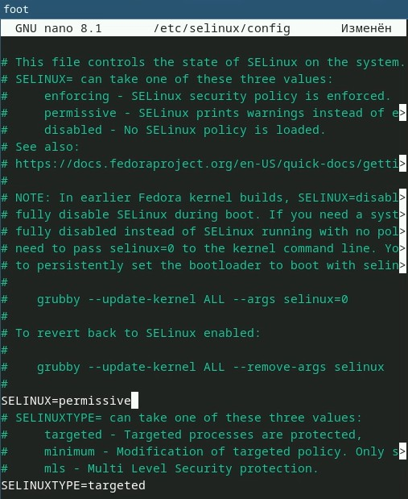{#fig:001 width=70%}

:::
::::::::::::::

## Запускаем терминальный мультиплексор, переключаемся в режим супер-пользователя и устанавливаем средства разработки

:::::::::::::: {.columns align=center}
::: {.column width="70%"}

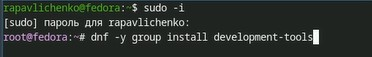

:::
::::::::::::::

## Подключаем образ диска дополнений гостевой ОC

:::::::::::::: {.columns align=center}
::: {.column width="70%"}

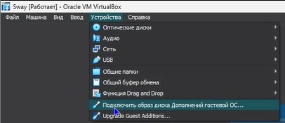{#fig:001 width=70%}

:::
::::::::::::::

##Монтируем его

:::::::::::::: {.columns align=center}
::: {.column width="70%"}

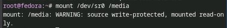{#fig:001 width=70%}
:::
::::::::::::::

##Устанавливаем драйвера и перезагружаем систему

:::::::::::::: {.columns align=center}
::: {.column width="70%"}

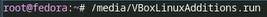{#fig:001 width=70%}

:::
::::::::::::::

##Делаем настройку клавиатуры, с помощью nano редактируем конфиругационный файл

:::::::::::::: {.columns align=center}
::: {.column width="70%"}

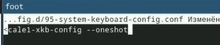{#fig:001 width=70%}

:::
::::::::::::::

##Редактируем второй конфигурационный файл

:::::::::::::: {.columns align=center}
::: {.column width="70%"}

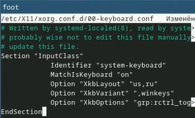{#fig:001 width=70%}

:::
::::::::::::::

## Меняем имя хоста на rapavlichenko (мои ФИО)

:::::::::::::: {.columns align=center}
::: {.column width="70%"}

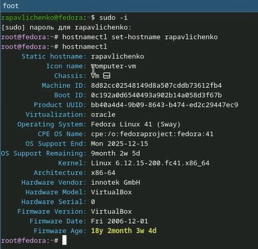{#fig:001 width=70%}

:::
::::::::::::::

##Устанавливаем pandoc

:::::::::::::: {.columns align=center}
::: {.column width="70%"}

{#fig:001 width=70%}

:::
::::::::::::::

##Скачиваем с git hub файл для скачивания pandoc-crossref

:::::::::::::: {.columns align=center}
::: {.column width="70%"}

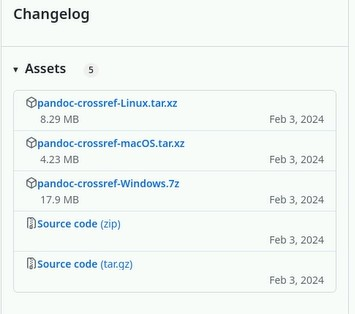{#fig:001 width=70%}

:::
::::::::::::::

##Распаковываем скачанные архивы и перемещаем их в каталог /usr/local/bin

:::::::::::::: {.columns align=center}
::: {.column width="70%"}

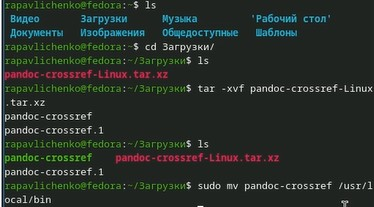{#fig:001 width=70%}
:::
::::::::::::::

## Скачиваем texlive

:::::::::::::: {.columns align=center}
::: {.column width="70%"}
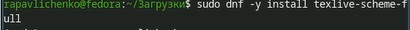{#fig:001 width=70%}

:::
::::::::::::::

## Выполняем домашнее задание

:::::::::::::: {.columns align=center}
::: {.column width="70%"}

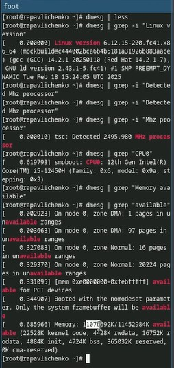{#fig:001 width=70%}
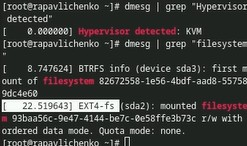{#fig:001 width=70%}

:::
::::::::::::::

## Выводы
Мы приобрели практические навыки установки операционной системы на
виртуальную машину, настройки минимально необходимых для дальнейшей работы
сервисов.
