---
## Front matter
title: "ОТЧЕТ
ПО ЛАБОРАТОРНОЙ РАБОТЕ № 1"
subtitle: "Установка OC Linux"
author: "Павличенко Родион Андреевич"

## Generic otions
lang: ru-RU
toc-title: "Содержание"

## Bibliography
bibliography: bib/cite.bib
csl: pandoc/csl/gost-r-7-0-5-2008-numeric.csl

## Pdf output format
toc: true # Table of contents
toc-depth: 2
lof: true # List of figures
lot: true # List of tables
fontsize: 12pt
linestretch: 1.5
papersize: a4
documentclass: scrreprt
## I18n polyglossia
polyglossia-lang:
  name: russian
  options:
	- spelling=modern
	- babelshorthands=true
polyglossia-otherlangs:
  name: english
## I18n babel
babel-lang: russian
babel-otherlangs: english
## Fonts
mainfont: IBM Plex Serif
romanfont: IBM Plex Serif
sansfont: IBM Plex Sans
monofont: IBM Plex Mono
mathfont: STIX Two Math
mainfontoptions: Ligatures=Common,Ligatures=TeX,Scale=0.94
romanfontoptions: Ligatures=Common,Ligatures=TeX,Scale=0.94
sansfontoptions: Ligatures=Common,Ligatures=TeX,Scale=MatchLowercase,Scale=0.94
monofontoptions: Scale=MatchLowercase,Scale=0.94,FakeStretch=0.9
mathfontoptions:
## Biblatex
biblatex: true
biblio-style: "gost-numeric"
biblatexoptions:
  - parentracker=true
  - backend=biber
  - hyperref=auto
  - language=auto
  - autolang=other*
  - citestyle=gost-numeric
## Pandoc-crossref LaTeX customization
figureTitle: "Рис."
tableTitle: "Таблица"
listingTitle: "Листинг"
lofTitle: "Список иллюстраций"
lotTitle: "Список таблиц"
lolTitle: "Листинги"
## Misc options
indent: true
header-includes:
  - \usepackage{indentfirst}
  - \usepackage{float} # keep figures where there are in the text
  - \floatplacement{figure}{H} # keep figures where there are in the text
---

# Цель работы

Приобретение практических навыков установки операционной системы
на виртуальную машину, настройки минимально необходимых для дальнейшей работы
сервисов

# Задание

Полная настройка и установка OC Linux

                                                      

# Выполнение лабораторной работы

Создаем новую виртуальную машину, указываем имя, выбираем диск,
производим настройку
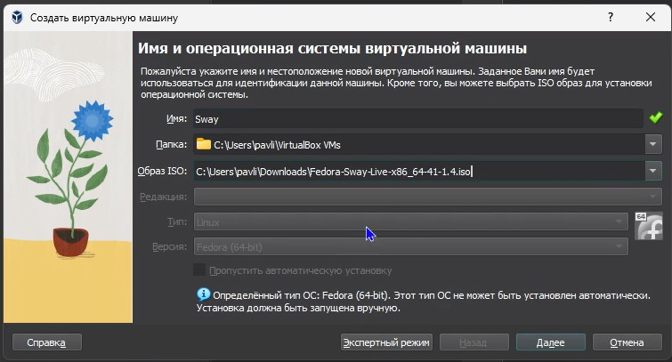{#fig:001 width=70%}

Настраиваем Sway, создаем учетную запись
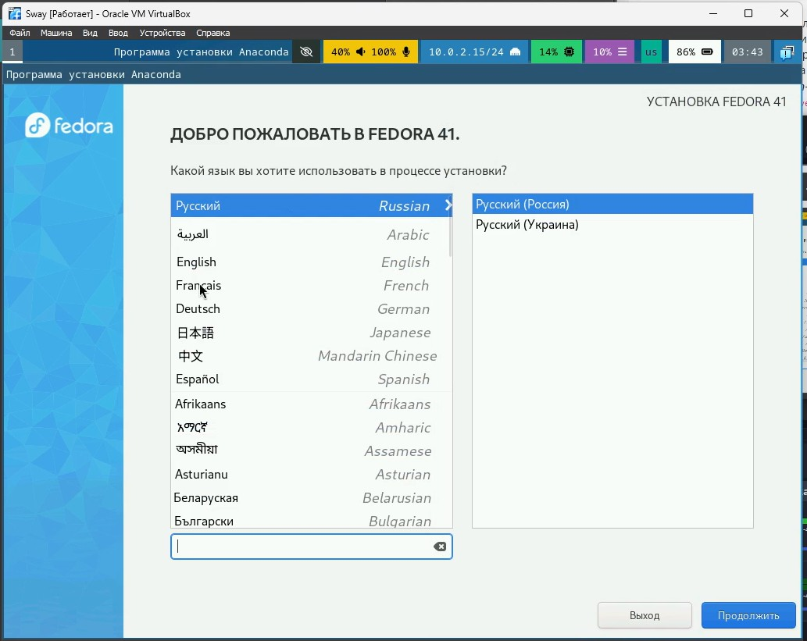{#fig:001 width=70%}

Включаем режим супер-пользователя, устанавливаем средства разработки
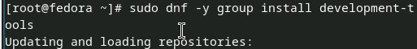{#fig:001 width=70%}

Обновляем пакеты
{#fig:001 width=70%}

Устанавливаем tmux для удобства работы в консоли
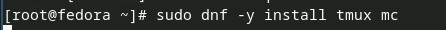{#fig:001 width=70%}

Устанавливаем автоматическое обновление
{#fig:001 width=70%}

Запускаем таймер
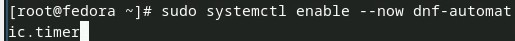{#fig:001 width=70%}

Отключаем SELinux , при помощи nano редактируем файл и перезапускаем систему
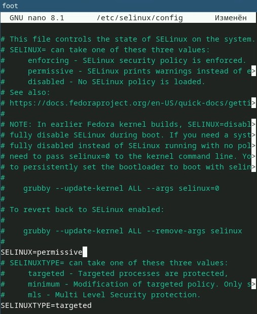{#fig:001 width=70%}

Запускаем терминальный мультиплексор, переключаемся в режим супер-пользователя и устанавливаем средства разработки
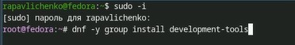{#fig:001 width=70%}

Подключаем образ диска дополнений гостевой ОC
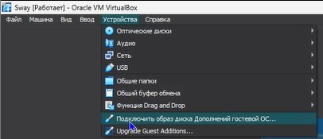{#fig:001 width=70%}

Монтируем его
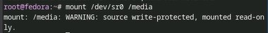{#fig:001 width=70%}

Устанавливаем драйвера и перезагружаем систему
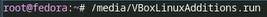{#fig:001 width=70%}

Делаем настройку клавиатуры, с помощью nano редактируем
конфиругационный файл
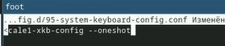{#fig:001 width=70%}

Редактируем второй конфигурационный файл
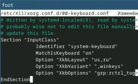{#fig:001 width=70%}

Меняем имя хоста на rapavlichenko (мои ФИО)
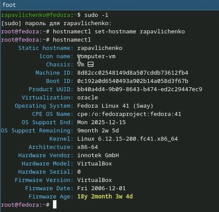{#fig:001 width=70%}

Устанавливаем pandoc
{#fig:001 width=70%}

Скачиваем с git hub файл для скачивания pandoc-crossref
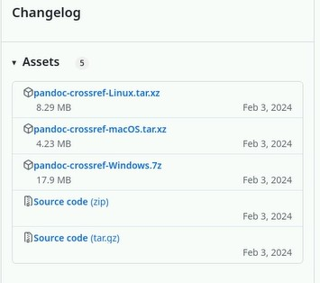{#fig:001 width=70%}

Распаковываем скачанные архивы и перемещаем их в каталог /usr/local/bin
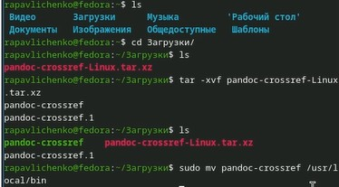{#fig:001 width=70%}

Скачиваем texlive
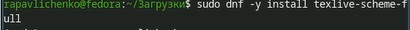{#fig:001 width=70%}

Выполняем домашнее задание
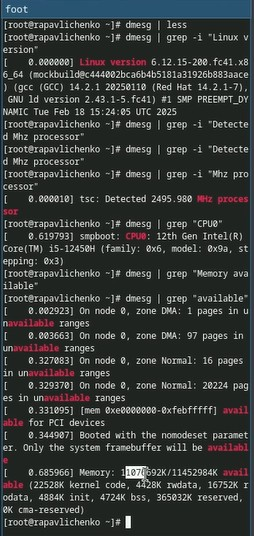{#fig:001 width=70%}
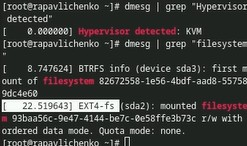{#fig:001 width=70%}

# Выводы
Мы приобрели практические навыки установки операционной системы на
виртуальную машину, настройки минимально необходимых для дальнейшей работы
сервисов.

# Список литературы{.unnumbered}

::: {#refs}
:::
