---
## Front matter
lang: ru-RU
title: Лабораторная работа №2
subtitle:  Первоначальная настройка Git
author:
  - Павличенко Родион Андреевич
institute:
  - Российский университет дружбы народов, Москва, Россия
date: 03 марта 2025

## i18n babel
babel-lang: russian
babel-otherlangs: english

## Formatting pdf
toc: false
toc-title: Содержание
slide_level: 2
aspectratio: 169
section-titles: true
theme: metropolis
header-includes:
 - \metroset{progressbar=frametitle,sectionpage=progressbar,numbering=fraction}
---

# Информация

## Докладчик

:::::::::::::: {.columns align=center}
::: {.column width="70%"}

  * Павличенко Родион Андреевич
  * Студент
  * Российский университет дружбы народов
  * [1132246838@pfur.ru](mailto:1132246838@pfur.ru)

:::
::: {.column width="30%"}

:::
::::::::::::::

## Цель

изучить идеологию и применение средств контроля версий.
Освоить умения по работе с git.

#Выполнение лабораторной работы

##Переходим в режим суперпользователя, устанавливаем пакет git и пакет ghр

:::
::: {.column width="30%"}

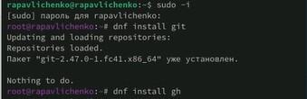{#fig:001 width=70%}

:::
::::::::::::::

## Задаем имя и email владельца репозитория (команды 1,2) ,настроим utf-8 (команда 3), зададим имя начальной ветке (команда 4), введем параметры autocrlf и safecrlf (команды 5,6)

:::
::: {.column width="30%"}

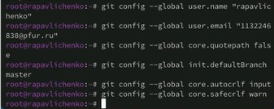{#fig:001 width=70%}

:::
::::::::::::::

##Создаем ключ ssh размером 4096 бит

:::
::: {.column width="30%"}

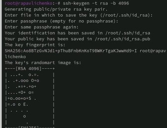{#fig:001 width=70%}
:::
::::::::::::::

##Создаем ключ по алгоритму ed25519

:::
::: {.column width="30%"}

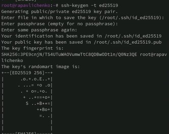{#fig:001 width=70%}

:::
::::::::::::::

##Генерируем pgp ключ с определенными параметрами
:::
::: {.column width="30%"}

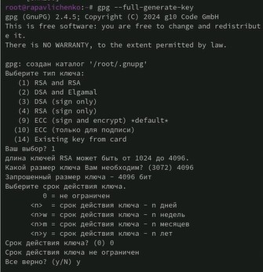{#fig:001 width=70%}

:::
::::::::::::::

##Копируем PGP-ключ в буфер обмена и переходим на github, вставляем полученный ключ

:::
::: {.column width="30%"}

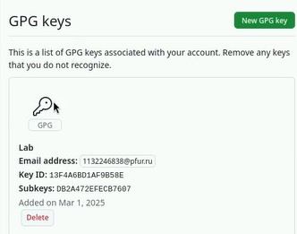{#fig:001 width=70%}

:::
::::::::::::::

##Вводим email и указываем git применять его при подписи коммитов, вводим три команды

:::
::: {.column width="30%"}

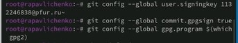{#fig:001 width=70%}

:::
::::::::::::::

##При помощи gh авторизируемся

:::
::: {.column width="30%"}

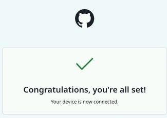{#fig:001 width=70%}

:::
::::::::::::::

##Создаем репозиторий курса на основе шаблона

:::
::: {.column width="30%"}

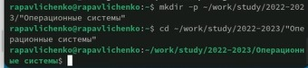{#fig:001 width=70%}
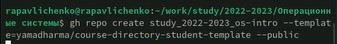{#fig:001 width=70%}

:::
::::::::::::::

##Настраиваем каталог курса, сначала переходим в него (команда 1), далее удаляем лишние файлы (команда 2) и создаем необходимые каталоги (команда3,4)

:::
::: {.column width="30%"}

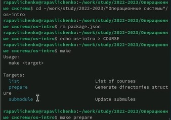{#fig:001 width=70%}

:::
::::::::::::::

##Отправляем файлы на сервер

:::
::: {.column width="30%"}

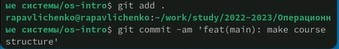{#fig:001 width=70%}

:::
::::::::::::::

## Выводы

Мы изучили идеологию и применение средств контроля версий.
Освоили умения по работе с git.

