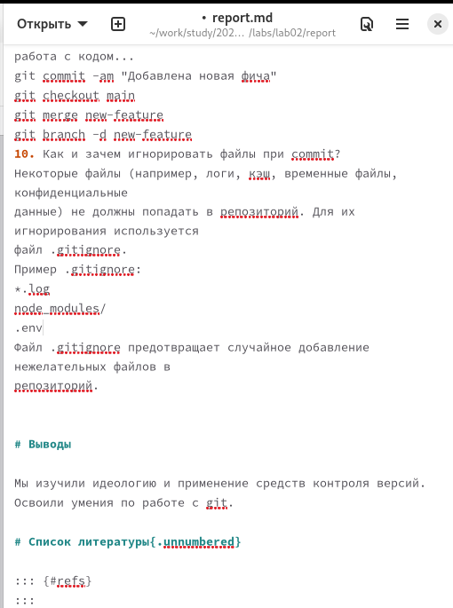
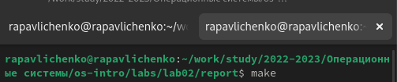
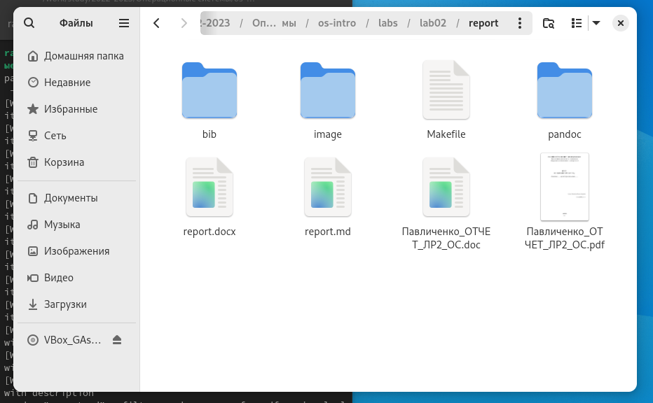

---
## Front matter
lang: ru-RU
title: Лабораторная работа №3
subtitle: Markdown
author:
  - Павличенко Родион Андреевич
institute:
  - Российский университет дружбы народов, Москва, Россия
date: 02 марта 2025

## i18n babel
babel-lang: russian
babel-otherlangs: english

## Formatting pdf
toc: false
toc-title: Содержание
slide_level: 2
aspectratio: 169
section-titles: true
theme: metropolis
header-includes:
 - \metroset{progressbar=frametitle,sectionpage=progressbar,numbering=fraction}
---

# Информация

## Докладчик

:::::::::::::: {.columns align=center}
::: {.column width="70%"}

  * Павличенко Родион Андреевич
  * Студент
  * Российский университет дружбы народов
  * [1132246838@pfur.ru](mailto:1132246838@pfur.ru)

:::
::: {.column width="30%"}

:::
::::::::::::::

## Цель

Научиться оформлять отчёты с помощью легковесного языка разметки Markdown.

## Задание
Сделайте отчёт по предыдущей лабораторной работе в формате Markdown.
В качестве отчёта просьба предоставить отчёты в 3 форматах: pdf, docx и md (в архиве, поскольку он должен содержать скриншоты, Makefile и т.д.)

## Открываем файл лабораторной работы №2 report.md и редактируем в соответствии с выполнением лабораторной работы №2

:::
::: {.column width="30%"}

:::
::::::::::::::

## Закрываем файл и открываем консоль, собираем с помощью команды make

:::
::: {.column width="30%"}

:::
::::::::::::::

## Проверяем, что файлы были созданы

:::
::: {.column width="30%"}

:::
::::::::::::::

## Вывод

Мы научились оформлять отчёты с помощью легковесного
языка разметки Markdown
