---
## Front matter
lang: ru-RU
title: Лабораторная работа №4
subtitle: Продвинутое использование git
author:
  - Павличенко Родион Андреевич
institute:
  - Российский университет дружбы народов, Москва, Россия
date: 3 марта 2025

## i18n babel
babel-lang: russian
babel-otherlangs: english

## Formatting pdf
toc: false
toc-title: Содержание
slide_level: 2
aspectratio: 169
section-titles: true
theme: metropolis
header-includes:
 - \metroset{progressbar=frametitle,sectionpage=progressbar,numbering=fraction}
---

# Информация

## Докладчик

:::::::::::::: {.columns align=center}
::: {.column width="70%"}

  * Павличенко Родион Андреевич
  * Студент
  * Российский университет дружбы народов
  * [1132246838@pfur.ru](mailto:1132246838@pfur.ru)

## Цель

Получение навыков правильной работы с репозиториями git.

# Выполнение лабораторной работы

## Устанавливаем git-flow

:::::::::::::: {.columns align=center}
::: {.column width="30%"}

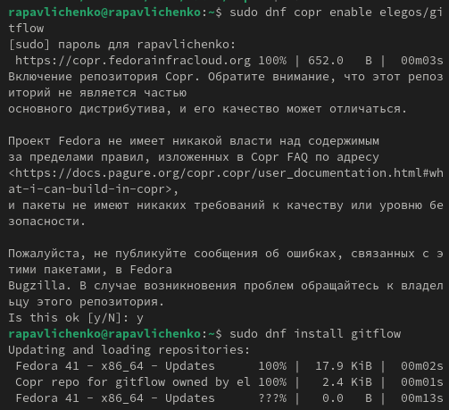

:::
::::::::::::::

## Устанавливаем Node.js и pnpm

:::::::::::::: {.columns align=center}
::: {.column width="30%"}

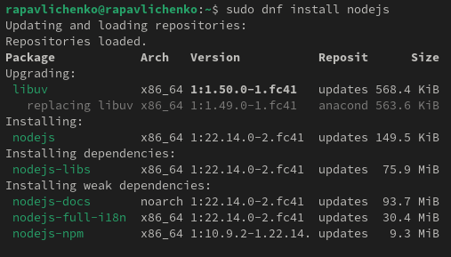

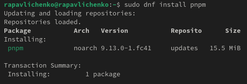

:::
::::::::::::::

## Настраиваем Node.js

:::::::::::::: {.columns align=center}
::: {.column width="30%"}

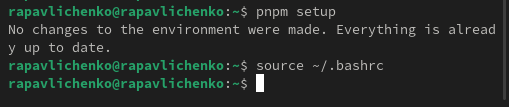

:::
::::::::::::::

## Настраиваем общепринятые коммиты, устанавливаем скрипт git cz, программу для помощи в форматировании коммитов (1 команда), программу для помощи в создании логов (2 команда)

:::::::::::::: {.columns align=center}
::: {.column width="30%"}

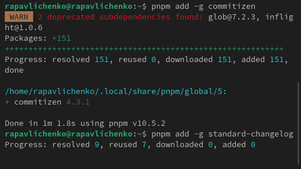

:::
::::::::::::::

## Создаем репозиторий git hub, называем его git-extended, клонируем его с помощью команды git clone –recursive,создаем файл README.md, делаем первый коммит и выкладываем на github

:::::::::::::: {.columns align=center}
::: {.column width="30%"}

:::
::::::::::::::

## Запускаем pnpm init и заполняем параметры пакета, добавляем новые файлы с помощью git add . , выполняем коммит командой git cz и отправляем на git hub с помощью командой git push

:::::::::::::: {.columns align=center}
::: {.column width="30%"}

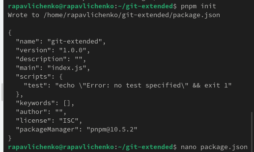

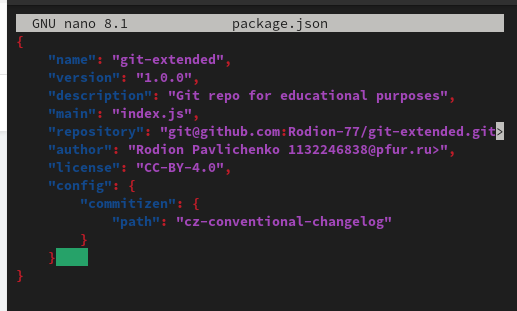

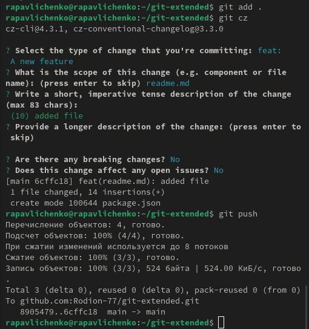

:::
::::::::::::::

## Инициализируем git-flow, устанавливаем префикс v, проверяем что мы находимся в ветки develop, загружаем весь репозиторий командой git push –all.Установливаем внешнюю ветку как вышестоящую для этой ветки: Создадем релиз с версией 1.0.0 Создадим журнал изменений changelog. Добавляем журнал изменений в индекс при помощи git add . и git commit -am 'chore(site): add changelog' . Заливаем релизную ветку в основную ветку. Отправляем данные на github и создадаем релиз.

:::::::::::::: {.columns align=center}
::: {.column width="30%"}

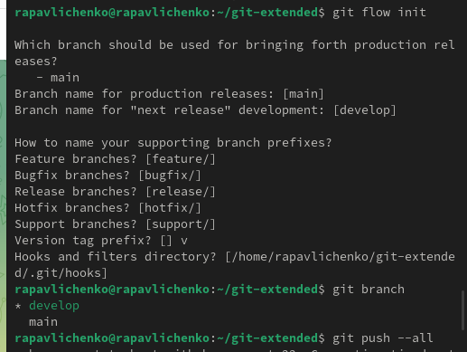

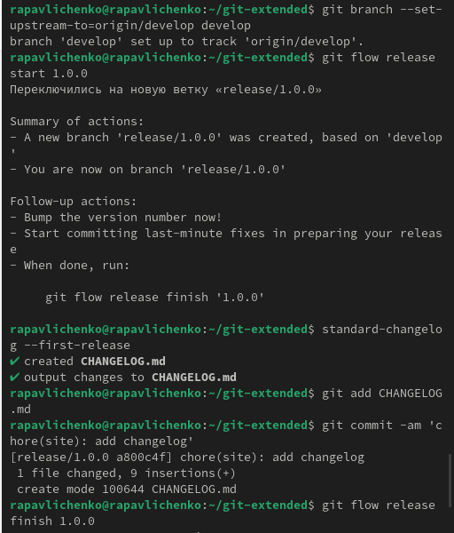

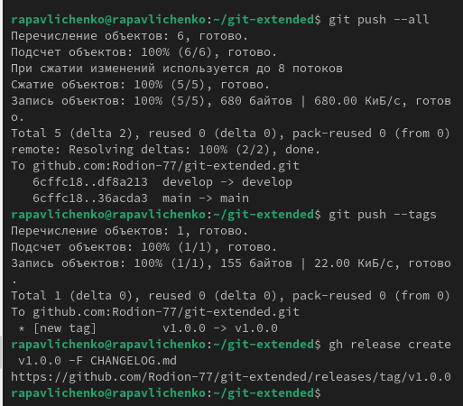

:::
::::::::::::::

## Работа с репозиторием git. Создадем ветку для новой функциональности и объединяем ее. Создаем релиз с версией 1.2.3 использую для редактирования nano. Создаем журнал изменений и добавляем журнал изменений в индекс, заливаем релизную ветку в основную. Отправляем данные на git hub, создаем релиз.

:::::::::::::: {.columns align=center}
::: {.column width="30%"}

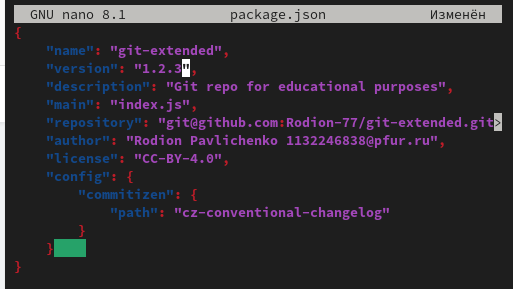

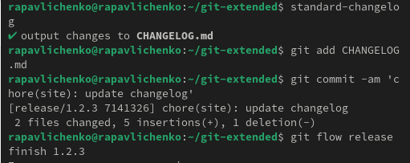

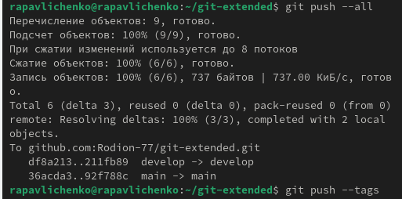

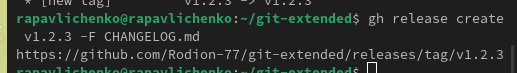

:::
::::::::::::::

## Выводы

-Мы получили навыки правильной работы с репозиториями git.

