---
## Front matter
title: "Лабораторная работа №4"
subtitle: "Продвинутое использование git"
author: "Павличенко Родион Андреевич"

## Generic otions
lang: ru-RU
toc-title: "Содержание"

## Bibliography
bibliography: bib/cite.bib
csl: pandoc/csl/gost-r-7-0-5-2008-numeric.csl

## Pdf output format
toc: true # Table of contents
toc-depth: 2
lof: true # List of figures
lot: true # List of tables
fontsize: 12pt
linestretch: 1.5
papersize: a4
documentclass: scrreprt
## I18n polyglossia
polyglossia-lang:
  name: russian
  options:
	- spelling=modern
	- babelshorthands=true
polyglossia-otherlangs:
  name: english
## I18n babel
babel-lang: russian
babel-otherlangs: english
## Fonts
mainfont: IBM Plex Serif
romanfont: IBM Plex Serif
sansfont: IBM Plex Sans
monofont: IBM Plex Mono
mathfont: STIX Two Math
mainfontoptions: Ligatures=Common,Ligatures=TeX,Scale=0.94
romanfontoptions: Ligatures=Common,Ligatures=TeX,Scale=0.94
sansfontoptions: Ligatures=Common,Ligatures=TeX,Scale=MatchLowercase,Scale=0.94
monofontoptions: Scale=MatchLowercase,Scale=0.94,FakeStretch=0.9
mathfontoptions:
## Biblatex
biblatex: true
biblio-style: "gost-numeric"
biblatexoptions:
  - parentracker=true
  - backend=biber
  - hyperref=auto
  - language=auto
  - autolang=other*
  - citestyle=gost-numeric
## Pandoc-crossref LaTeX customization
figureTitle: "Рис."
tableTitle: "Таблица"
listingTitle: "Листинг"
lofTitle: "Список иллюстраций"
lotTitle: "Список таблиц"
lolTitle: "Листинги"
## Misc options
indent: true
header-includes:
  - \usepackage{indentfirst}
  - \usepackage{float} # keep figures where there are in the text
  - \floatplacement{figure}{H} # keep figures where there are in the text
---

# Цель работы

Получение навыков правильной работы с репозиториями git.

# Задание

-Выполнить работу для тестового репозитория.
-Преобразовать рабочий репозиторий в репозиторий с git-flow и conventional commits.

# Выполнение лабораторной работы

Устанавливаем git-flow

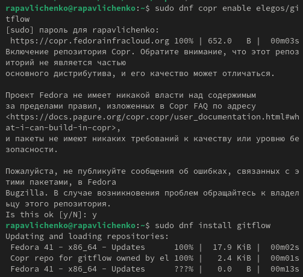{#fig:001 width=70%}

Устанавливаем Node.js и pnpm

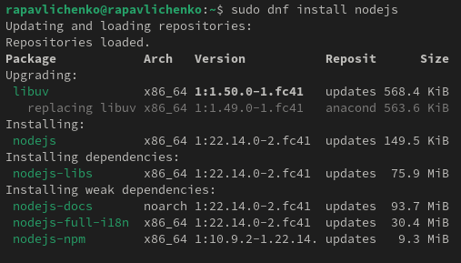{#fig:002 width=70%}

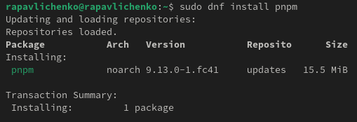{#fig:003 width=70%}

Настраиваем Node.js

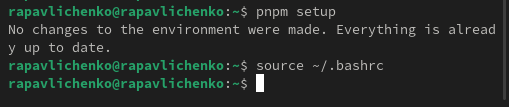{#fig:004 width=70%}

Настраиваем общепринятые коммиты, устанавливаем скрипт git cz, программу для помощи в форматировании коммитов (1 команда), программу для помощи в создании логов (2 команда)

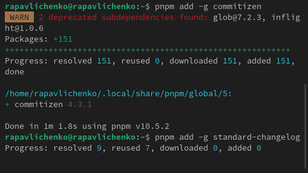{#fig:005 width=70%}

Создаем репозиторий git hub, называем его git-extended, клонируем его с помощью команды git clone –recursive,создаем файл README.md, делаем первый коммит и выкладываем на github

{#fig:006 width=70%}

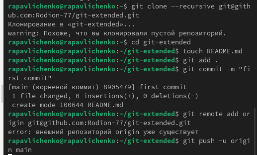{#fig:007 width=70%}

Запускаем pnpm init и заполняем параметры пакета, добавляем новые файлы с помощью git add . , выполняем коммит командой git cz и отправляем на git hub с помощью командой git push

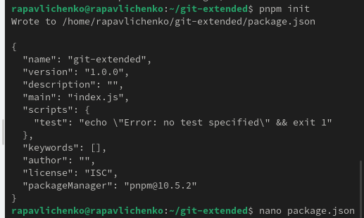{#fig:008 width=70%}

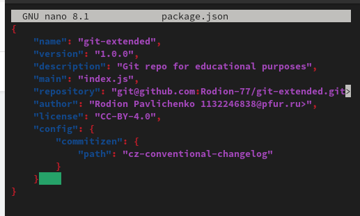{#fig:009 width=70%}

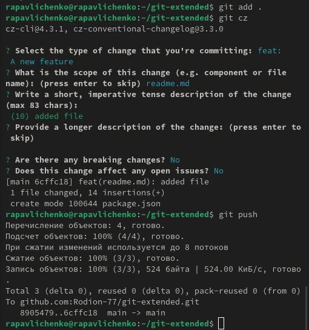{#fig:010 width=70%}

Инициализируем git-flow, устанавливаем префикс v, проверяем что мы находимся в ветки develop, загружаем весь репозиторий командой git push –all.Установливаем внешнюю ветку как вышестоящую для этой ветки: Создадем релиз с версией 1.0.0 Создадим журнал изменений changelog. Добавляем журнал изменений в индекс при помощи git add . и git commit -am 'chore(site): add changelog' . Заливаем релизную ветку в основную ветку. Отправляем данные на github и создадаем релиз.

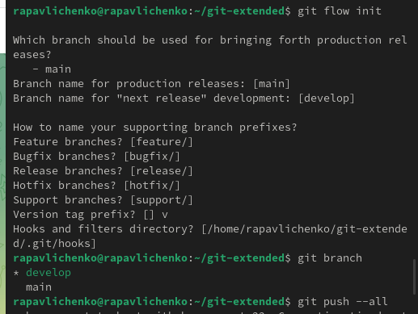{#fig:011 width=70%}

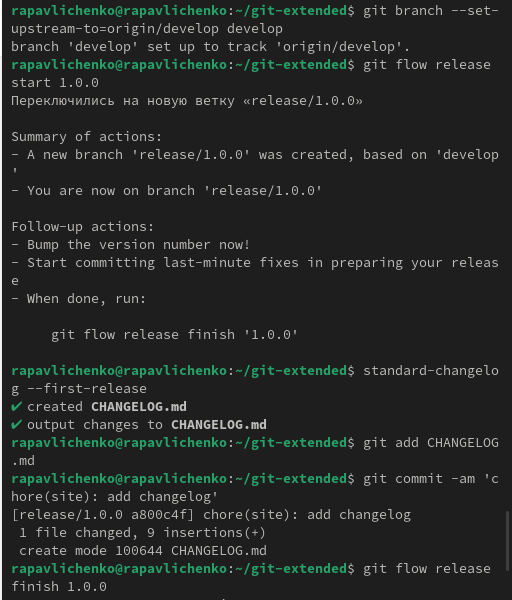{#fig:012 width=70%}

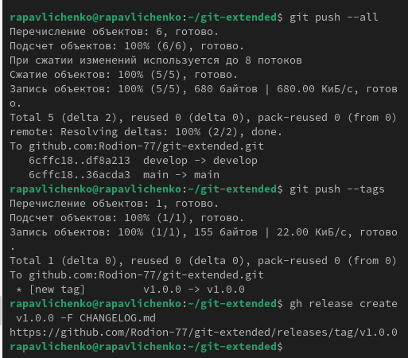{#fig:013 width=70%}

Работа с репозиторием git. Создадем ветку для новой функциональности и объединяем ее. Создаем релиз с версией 1.2.3 использую для редактирования nano. Создаем журнал изменений и добавляем журнал изменений в индекс, заливаем релизную ветку в основную. Отправляем данные на git hub, создаем релиз.

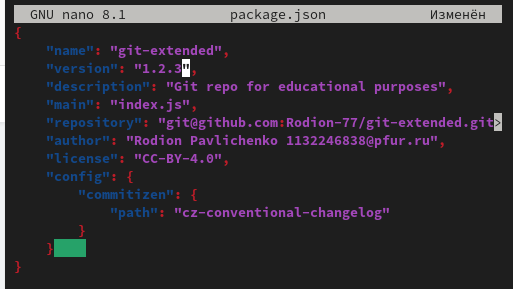{#fig:014 width=70%}

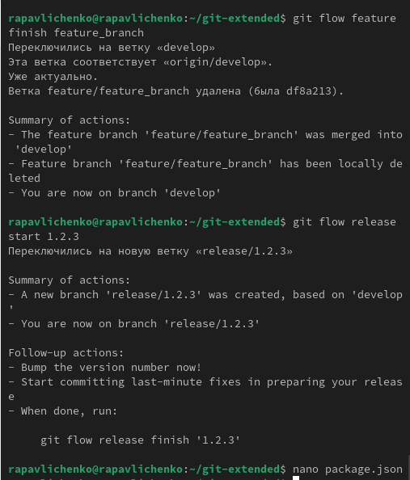{#fig:015 width=70%}

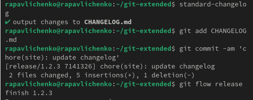{#fig:016 width=70%}

{#fig:017 width=70%}

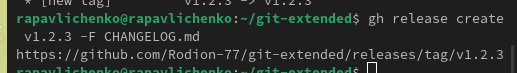{#fig:018 width=70%}

# Выводы

Мы получили навыки правильной работы с репозиториями git.

# Список литературы{.unnumbered}

::: {#refs}
:::
