---
## Front matter
lang: ru-RU
title: Лабораторная работа № 5 
subtitle: 
author:
  - Павличенко Родион Андреевич
institute:
  - Российский университет дружбы народов, Москва, Россия

## i18n babel
babel-lang: russian
babel-otherlangs: english

## Formatting pdf
toc: false
toc-title: Содержание
slide_level: 2
aspectratio: 169
section-titles: true
theme: metropolis
header-includes:
 - \metroset{progressbar=frametitle,sectionpage=progressbar,numbering=fraction}
---

# Информация

## Докладчик

:::::::::::::: {.columns align=center}
::: {.column width="70%"}

  * Павличенко Родион Андреевич
  * студент
  * Российский университет дружбы народов
  * [1132246838@pfur.ru](mailto:1132246838@pfur.ru)
  
:::
::: {.column width="30%"}

:::
::::::::::::::

# Выполнение лабораторной работы

## Устанавливаем pass и gopass через команду dnf install от прав sudo (суперпользователя)

:::::::::::::: {.columns align=center}
::: {.column width="30%"}

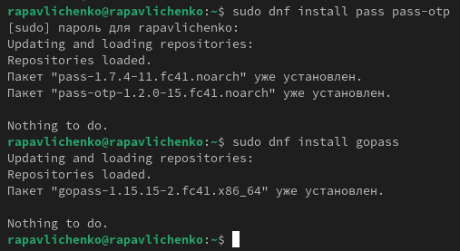

:::
::::::::::::::

## Просматриваем списки ключей и генерируем ключ

:::::::::::::: {.columns align=center}
::: {.column width="30%"}

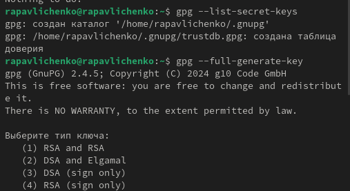

:::
::::::::::::::

## Создаем новый репозиторий pass

:::::::::::::: {.columns align=center}
::: {.column width="30%"}

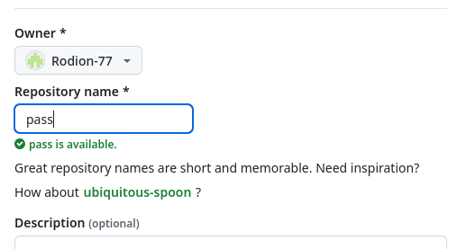

:::
::::::::::::::

## Инициализируем хранилище через команду pass init и создаем структуру git
:::::::::::::: {.columns align=center}
::: {.column width="30%"}

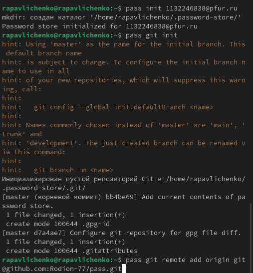

:::
::::::::::::::

## Синхронизируем репозиторий командами pass git pull и pass git push

:::::::::::::: {.columns align=center}
::: {.column width="30%"}

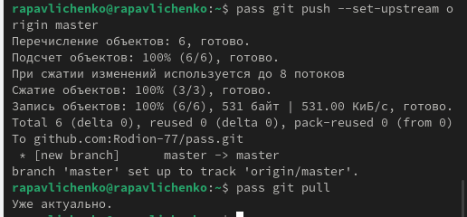

:::
::::::::::::::

## Комитим и выкладываем изменения на git , проверяем статус синхронизации

:::::::::::::: {.columns align=center}
::: {.column width="30%"}

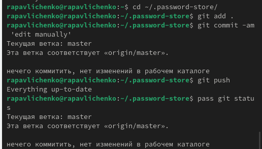

:::
::::::::::::::

## Настраиваем интерфейс браузера командами dnf copr enable maximbaz/browserpass и dnf install browserpass

:::::::::::::: {.columns align=center}
::: {.column width="30%"}

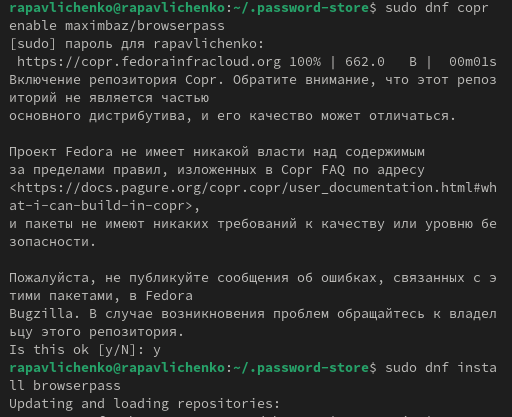

:::
::::::::::::::

## Устанавливаем плагин для Firefox

:::::::::::::: {.columns align=center}
::: {.column width="30%"}

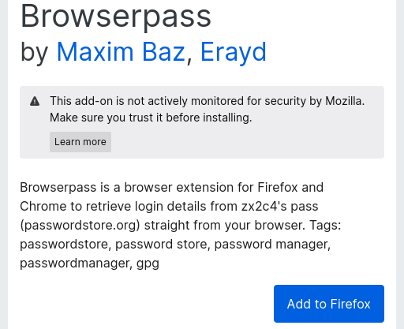

:::
::::::::::::::

## Создаем файл pass.txt и добавляем новый пароль, отображаем пароль командой pass и заменяем пароль

:::::::::::::: {.columns align=center}
::: {.column width="30%"}

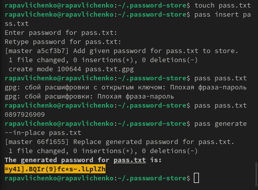

:::
::::::::::::::

## Устанавливаем дополнительное программное обеспечение

:::::::::::::: {.columns align=center}
::: {.column width="30%"}

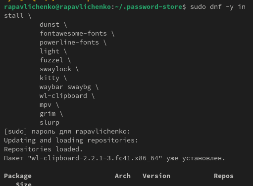

:::
::::::::::::::

## Устанавливаем шрифты

:::::::::::::: {.columns align=center}
::: {.column width="30%"}

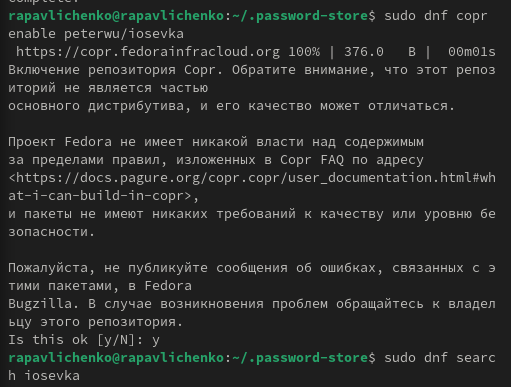
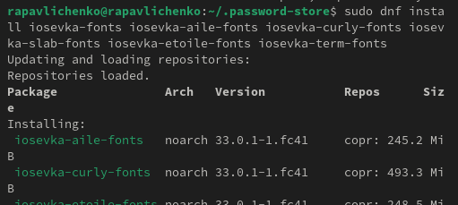

:::
::::::::::::::

## Устанавливаем бинарный файл

:::::::::::::: {.columns align=center}
::: {.column width="30%"}

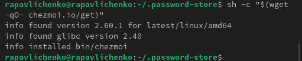

:::
::::::::::::::

## Создаем собственный репозиторий с помощью утилит командой gh repo create dotfiles --template="yamadharma/dotfiles-template" –private и подключаем репозиторий к своей системе

:::::::::::::: {.columns align=center}
::: {.column width="30%"}

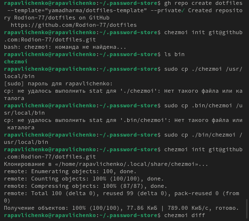

:::
::::::::::::::

## Извлекаем последние изменения из репозитория и применяем их командами chezmoi update, hezmoi git pull -- --autostash --rebase && chezmoi diff, chezmoi apply.

:::::::::::::: {.columns align=center}
::: {.column width="30%"}

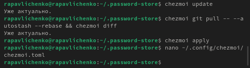

:::
::::::::::::::

## Вывод

мы настроили рабочую среду, разобрались как работает менеджер паролей pass.

