---
## Front matter
title: "Лабораторная работа № 5"
subtitle: "Настройка рабочей среды"
author: "Павличенко Родион Андреевич"

## Generic otions
lang: ru-RU
toc-title: "Содержание"

## Bibliography
bibliography: bib/cite.bib
csl: pandoc/csl/gost-r-7-0-5-2008-numeric.csl

## Pdf output format
toc: true # Table of contents
toc-depth: 2
lof: true # List of figures
lot: true # List of tables
fontsize: 12pt
linestretch: 1.5
papersize: a4
documentclass: scrreprt
## I18n polyglossia
polyglossia-lang:
  name: russian
  options:
	- spelling=modern
	- babelshorthands=true
polyglossia-otherlangs:
  name: english
## I18n babel
babel-lang: russian
babel-otherlangs: english
## Fonts
mainfont: IBM Plex Serif
romanfont: IBM Plex Serif
sansfont: IBM Plex Sans
monofont: IBM Plex Mono
mathfont: STIX Two Math
mainfontoptions: Ligatures=Common,Ligatures=TeX,Scale=0.94
romanfontoptions: Ligatures=Common,Ligatures=TeX,Scale=0.94
sansfontoptions: Ligatures=Common,Ligatures=TeX,Scale=MatchLowercase,Scale=0.94
monofontoptions: Scale=MatchLowercase,Scale=0.94,FakeStretch=0.9
mathfontoptions:
## Biblatex
biblatex: true
biblio-style: "gost-numeric"
biblatexoptions:
  - parentracker=true
  - backend=biber
  - hyperref=auto
  - language=auto
  - autolang=other*
  - citestyle=gost-numeric
## Pandoc-crossref LaTeX customization
figureTitle: "Рис."
tableTitle: "Таблица"
listingTitle: "Листинг"
lofTitle: "Список иллюстраций"
lotTitle: "Список таблиц"
lolTitle: "Листинги"
## Misc options
indent: true
header-includes:
  - \usepackage{indentfirst}
  - \usepackage{float} # keep figures where there are in the text
  - \floatplacement{figure}{H} # keep figures where there are in the text
---

# Цель работы

Настроить рабочую среду, разобраться как работает менеджер паролей pass.

# Выполнение лабораторной работы

станавливаем pass и gopass через команду dnf install от прав sudo (суперпользователя)

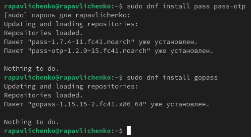{#fig:001 width=70%}

Просматриваем списки ключей и генерируем ключ

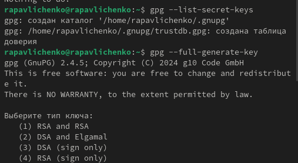{#fig:002 width=70%}

Создаем новый репозиторий pass

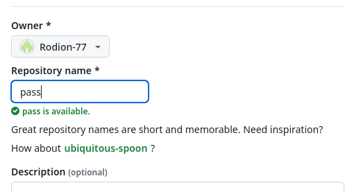{#fig:003 width=70%}

Инициализируем хранилище через команду pass init и создаем структуру git

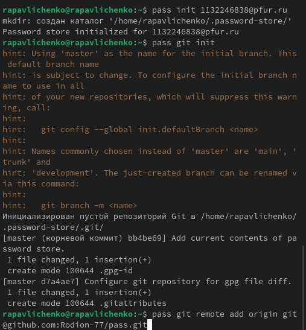{#fig:004 width=70%}

Синхронизируем репозиторий командами pass git pull и pass git push

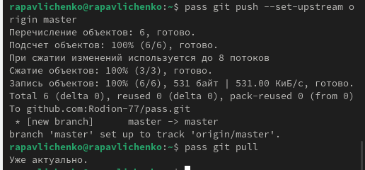{#fig:005 width=70%}

Комитим и выкладываем изменения на git , проверяем статус синхронизации

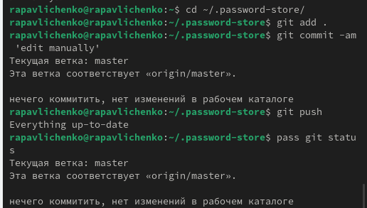{#fig:006 width=70%}

Настраиваем интерфейс браузера командами dnf copr enable maximbaz/browserpass и dnf install browserpass

{#fig:007 width=70%}

Устанавливаем плагин для Firefox

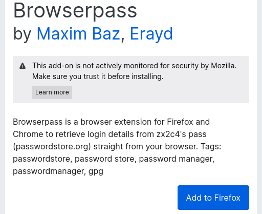{#fig:008 width=70%}

Создаем файл pass.txt и добавляем новый пароль, отображаем пароль командой pass и заменяем пароль

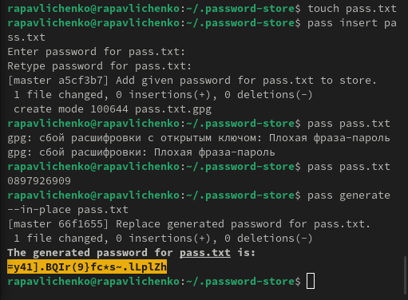{#fig:009 width=70%}

Устанавливаем дополнительное программное обеспечение

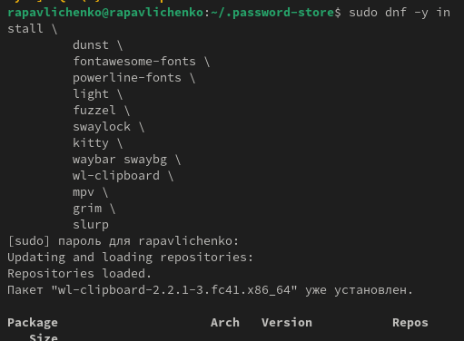{#fig:010 width=70%}

Устанавливаем шрифты

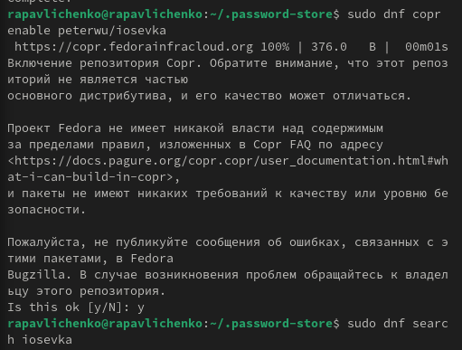{#fig:011 width=70%}

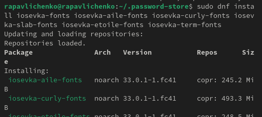{#fig:012 width=70%}

Устанавливаем бинарный файл

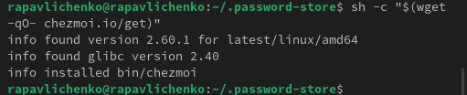{#fig:013 width=70%}

Создаем собственный репозиторий с помощью утилит командой gh repo create dotfiles --template="yamadharma/dotfiles-template" –private и подключаем репозиторий к своей системе

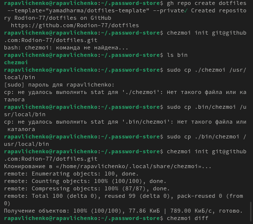{#fig:014 width=70%}

Извлекаем последние изменения из репозитория и применяем их командами chezmoi update, hezmoi git pull -- --autostash --rebase && chezmoi diff, chezmoi apply.

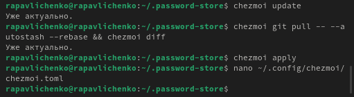{#fig:015 width=70%}

# Выводы

Мы настроили рабочую среду, разобрались как работает менеджер паролей pass.

