---
## Front matter
lang: ru-RU
title: Лабораторная работа № 6
subtitle: Основы интерфейса взаимодействия пользователя с системой Unix на уровне командной строки
author:
  - Павличенко Родион Андреевич
institute:
  - Российский университет дружбы народов, Москва, Россия

## i18n babel
babel-lang: russian
babel-otherlangs: english

## Formatting pdf
toc: false
toc-title: Содержание
slide_level: 2
aspectratio: 169
section-titles: true
theme: metropolis
header-includes:
 - \metroset{progressbar=frametitle,sectionpage=progressbar,numbering=fraction}
---

# Информация

## Докладчик

:::::::::::::: {.columns align=center}
::: {.column width="70%"}

  * Павличенко Родион Андреевич
  * студент
  * Российский университет дружбы народов
  * [1132246838@pfur.ru](mailto:1132246838@pfur.ru)
  
:::
::: {.column width="30%"}

:::
::::::::::::::

# Выполнение лабораторной работы

## Определяем полное имя нашего домашнего каталога. Переходим в каталог /tmp. Выведим на экран содержимое каталога /tmp. Для этого используем команду ls с различными опциями.

:::::::::::::: {.columns align=center}
::: {.column width="30%"}

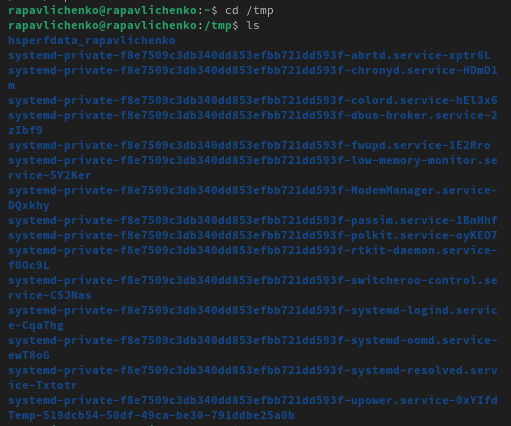
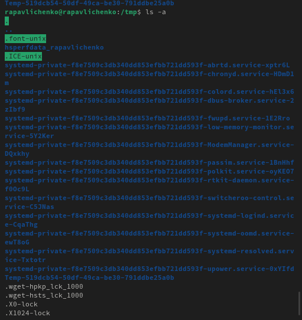
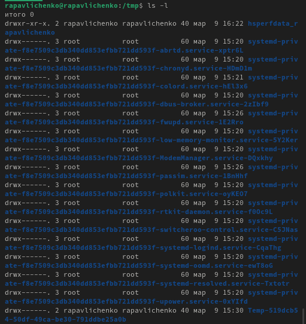
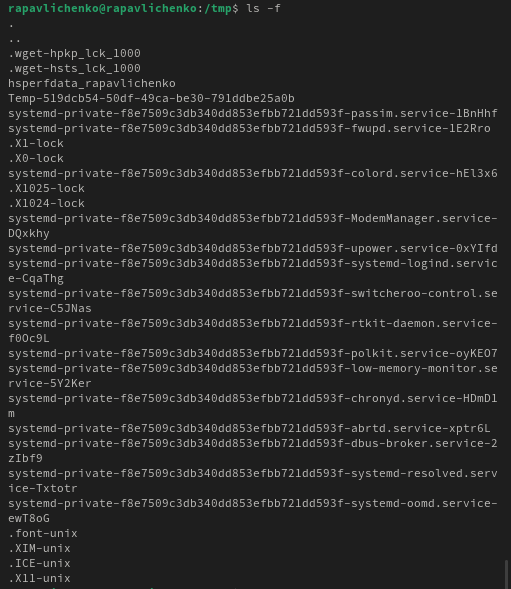

:::
::::::::::::::

## Переходим в каталог е /var/spool и проверяем, что файла cron

:::::::::::::: {.columns align=center}
::: {.column width="30%"}

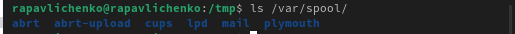

:::
::::::::::::::

## Переходим в домашний каталог и выведим на экран его содержимое

:::::::::::::: {.columns align=center}
::: {.column width="30%"}

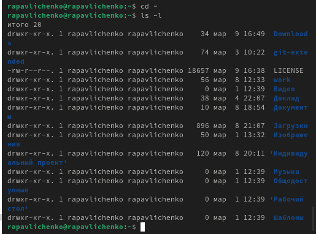

:::
::::::::::::::

## Создаем в домашнем каталоге каталог newdir , а в нем каталог с именем morefun
:::::::::::::: {.columns align=center}
::: {.column width="30%"}

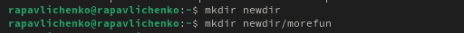

:::
::::::::::::::

## Создаем и удаляем одной командой три файла

:::::::::::::: {.columns align=center}
::: {.column width="30%"}

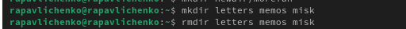

:::
::::::::::::::

## Удаляем каталог /newdir/morefun из домашнего каталога

:::::::::::::: {.columns align=center}
::: {.column width="30%"}

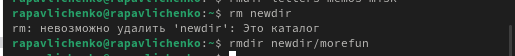

:::
::::::::::::::

## С помощью команды man определяем, какую опцию команды ls нужно использовать для просмотра содержимое не только указанного каталога, но и подкаталогов, входящих в него. Это -R

:::::::::::::: {.columns align=center}
::: {.column width="30%"}

:::
::::::::::::::

## С помощью команды man определяем набор опций команды ls, позволяющий отсортировать по времени последнего изменения выводимый список содержимого каталога с развёрнутым описанием файлов. Это -t

:::::::::::::: {.columns align=center}
::: {.column width="30%"}

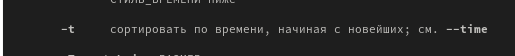

:::
::::::::::::::

## Используем команду man для просмотра описания следующих команд: cd, pwd, mkdir,

:::::::::::::: {.columns align=center}
::: {.column width="30%"}

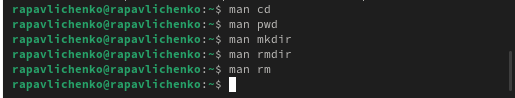

:::
::::::::::::::

## 1. cd (Change Directory – смена каталога)

:::::::::::::: {.columns align=center}
::: {.column width="30%"}

cd <путь> – переход в указанный каталог.

cd .. – подняться на уровень выше.

cd - – вернуться в предыдущий каталог.

cd ~ или просто cd – перейти в домашний каталог пользователя.

:::
::::::::::::::

## 2. pwd (Print Working Directory – показать текущий каталог)

:::::::::::::: {.columns align=center}
::: {.column width="30%"}

pwd – выводит полный путь текущего каталога.

pwd -L – показывает логический путь (с учетом символических ссылок, если есть).

pwd -P – выводит физический путь (без учета символических ссылок).

:::
::::::::::::::

## 3. mkdir (Make Directory – создать каталог)

:::::::::::::: {.columns align=center}
::: {.column width="30%"}

mkdir <имя> – создаёт новый каталог.

mkdir -p <путь> – создаёт вложенные каталоги, если они не существуют.

mkdir -m <права> <имя> – создаёт каталог с указанными правами (например, mkdir -m 755 dir).

:::
::::::::::::::

## 4. rmdir (Remove Directory – удалить каталог)

:::::::::::::: {.columns align=center}
::: {.column width="30%"}

rmdir <имя> – удаляет пустой каталог.

rmdir -p <путь> – удаляет цепочку пустых родительских каталогов.

:::
::::::::::::::

## 5. rm (Remove – удалить файлы/каталоги)

:::::::::::::: {.columns align=center}
::: {.column width="30%"}

rm <файл> – удаляет файл.

rm -r <каталог> – рекурсивно удаляет каталог и его содержимое.

rm -f <файл> – принудительно удаляет файл без запроса подтверждения.

rm -i <файл> – запрашивает подтверждение перед удалением.

rm -v <файл> – показывает, какие файлы удаляются.

:::
::::::::::::::

## Используя информацию, полученную при помощи команды history, выполнили модификацию и исполнение нескольких команд из буфера команд.

:::::::::::::: {.columns align=center}
::: {.column width="30%"}

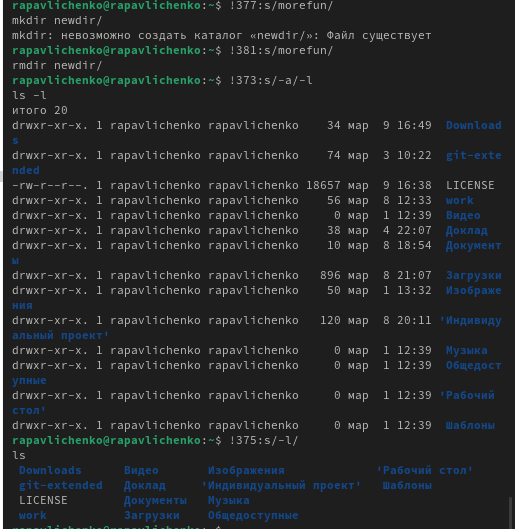

:::
::::::::::::::

## Вывод

Мы приобрели практических навыков взаимодействия пользователя с системой посредством командной строки.
