---
## Front matter
title: "Лабораторная работа № 6"
subtitle: "Основы интерфейса взаимодействия пользователя с системой Unix на уровне командной строки"
author: "Павличенко Родион Андреевич"

## Generic otions
lang: ru-RU
toc-title: "Содержание"

## Bibliography
bibliography: bib/cite.bib
csl: pandoc/csl/gost-r-7-0-5-2008-numeric.csl

## Pdf output format
toc: true # Table of contents
toc-depth: 2
lof: true # List of figures
lot: true # List of tables
fontsize: 12pt
linestretch: 1.5
papersize: a4
documentclass: scrreprt
## I18n polyglossia
polyglossia-lang:
  name: russian
  options:
	- spelling=modern
	- babelshorthands=true
polyglossia-otherlangs:
  name: english
## I18n babel
babel-lang: russian
babel-otherlangs: english
## Fonts
mainfont: IBM Plex Serif
romanfont: IBM Plex Serif
sansfont: IBM Plex Sans
monofont: IBM Plex Mono
mathfont: STIX Two Math
mainfontoptions: Ligatures=Common,Ligatures=TeX,Scale=0.94
romanfontoptions: Ligatures=Common,Ligatures=TeX,Scale=0.94
sansfontoptions: Ligatures=Common,Ligatures=TeX,Scale=MatchLowercase,Scale=0.94
monofontoptions: Scale=MatchLowercase,Scale=0.94,FakeStretch=0.9
mathfontoptions:
## Biblatex
biblatex: true
biblio-style: "gost-numeric"
biblatexoptions:
  - parentracker=true
  - backend=biber
  - hyperref=auto
  - language=auto
  - autolang=other*
  - citestyle=gost-numeric
## Pandoc-crossref LaTeX customization
figureTitle: "Рис."
tableTitle: "Таблица"
listingTitle: "Листинг"
lofTitle: "Список иллюстраций"
lotTitle: "Список таблиц"
lolTitle: "Листинги"
## Misc options
indent: true
header-includes:
  - \usepackage{indentfirst}
  - \usepackage{float} # keep figures where there are in the text
  - \floatplacement{figure}{H} # keep figures where there are in the text
---

# Цель работы

Приобретение практических навыков взаимодействия пользователя с системой посредством командной строки.

# Выполнение лабораторной работы

Определяем полное имя нашего домашнего каталога. Переходим в каталог /tmp.
Выведим на экран содержимое каталога /tmp. Для этого используем команду ls с различными опциями.

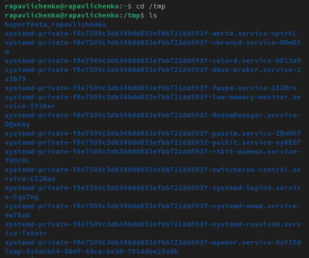{#fig:001 width=70%}

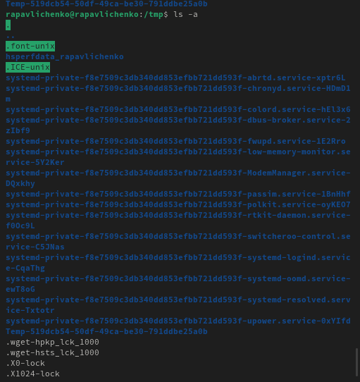{#fig:002 width=70%}

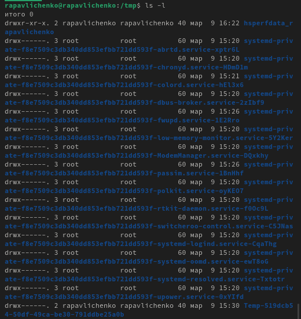{#fig:003 width=70%}

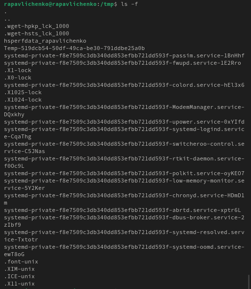{#fig:004 width=70%}

Переходим в каталог е /var/spool и проверяем, что файла cron

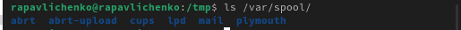{#fig:005 width=70%}

Переходим в домашний каталог и выведим на экран его содержимое

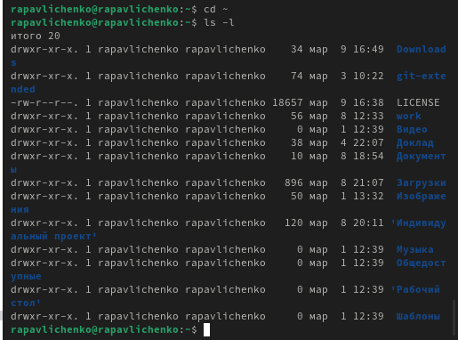{#fig:006 width=70%}

Создаем в домашнем каталоге каталог newdir , а в нем каталог с именем morefun

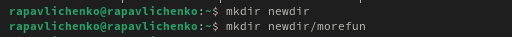{#fig:007 width=70%}

Создаем и удаляем одной командой три файла

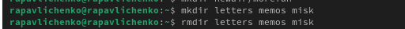{#fig:00888 width=70%}

Удаляем каталог /newdir/morefun из домашнего каталога
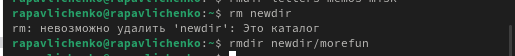{#fig:009 width=70%}

С помощью команды man определяем, какую опцию команды ls нужно использовать для просмотра содержимое не только указанного каталога, но и подкаталогов, входящих в него. Это -R

{#fig:010 width=70%}

С помощью команды man определяем набор опций команды ls, позволяющий отсортировать по времени последнего изменения выводимый список содержимого каталога с развёрнутым описанием файлов. Это -t

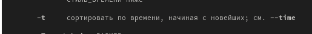{#fig:011 width=70%}

Используем команду man для просмотра описания следующих команд: cd, pwd, mkdir,
rmdir, rm. 

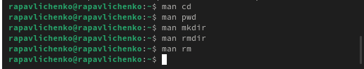{#fig:012 width=70%}

Основные параметры команд:
1. cd (Change Directory – смена каталога)

cd <путь> – переход в указанный каталог.

cd .. – подняться на уровень выше.

cd - – вернуться в предыдущий каталог.

cd ~ или просто cd – перейти в домашний каталог пользователя.

2. pwd (Print Working Directory – показать текущий каталог)

pwd – выводит полный путь текущего каталога.

pwd -L – показывает логический путь (с учетом символических ссылок, если есть).

pwd -P – выводит физический путь (без учета символических ссылок).

3. mkdir (Make Directory – создать каталог)

mkdir <имя> – создаёт новый каталог.

mkdir -p <путь> – создаёт вложенные каталоги, если они не существуют.

mkdir -m <права> <имя> – создаёт каталог с указанными правами (например, mkdir -m 755 dir).

4. rmdir (Remove Directory – удалить каталог)

rmdir <имя> – удаляет пустой каталог.

rmdir -p <путь> – удаляет цепочку пустых родительских каталогов.

5. rm (Remove – удалить файлы/каталоги)

rm <файл> – удаляет файл.

rm -r <каталог> – рекурсивно удаляет каталог и его содержимое.

rm -f <файл> – принудительно удаляет файл без запроса подтверждения.

rm -i <файл> – запрашивает подтверждение перед удалением.

rm -v <файл> – показывает, какие файлы удаляются.

Используя информацию, полученную при помощи команды history, выполнили модификацию и исполнение нескольких команд из буфера команд.

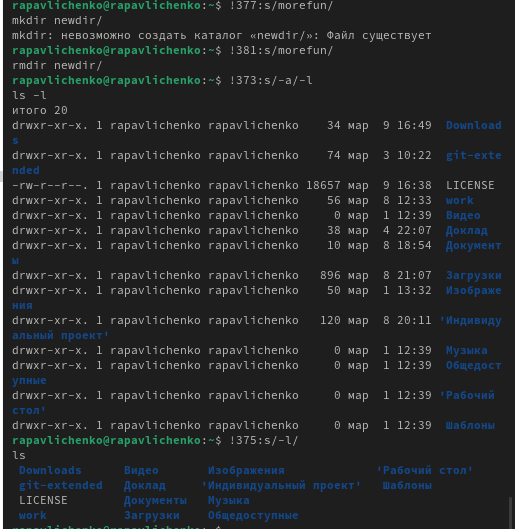{#fig:013 width=70%}

# Контрольный вопросы

1. Командная строка — это текстовый интерфейс операционной системы, позволяющий пользователю вводить команды для управления системой.

2. Для определения абсолютного пути текущего каталога используется команда pwd.

3. Чтобы вывести только тип файлов и их имена в текущем каталоге, используется команда ls -F.

4. Для отображения скрытых файлов используется команда ls -a.

5. Чтобы удалить файл, используйте команду rm, а чтобы удалить каталог — rm -r, причём одной командой rm -rf можно удалить как файлы, так и каталоги.

6. Историю выполненных команд можно просмотреть с помощью history.

7. Для повторного выполнения команд из истории можно использовать !! для последней команды, !n для команды с номером n или !<имя_команды> для последнего вызова данной команды.

8. Запуск нескольких команд в одной строке можно выполнить с помощью ;, && или ||, в зависимости от логики выполнения.

9. Экранирующие символы позволяют интерпретировать специальные символы как обычные, например, $ кавычки или \.

10. При выполнении ls -l отображается подробная информация о файлах, включая права доступа, владельца, размер и дату изменения.

11. Относительный путь — это путь, заданный относительно текущего каталога, а абсолютный путь начинается с корня файловой системы.

12. Для получения информации о команде можно воспользоваться man или --help.

13. Автодополнение команд выполняется клавишей Tab.

# Выводы

Мы приобрели практических навыков взаимодействия пользователя с системой посредством командной строки.
