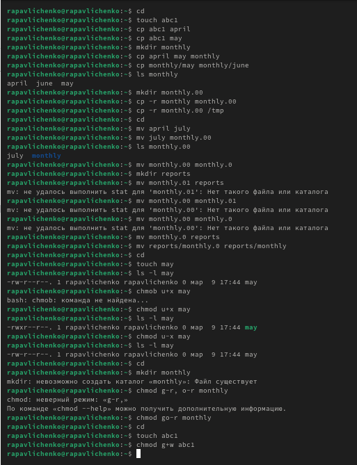
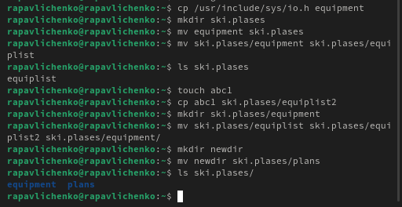
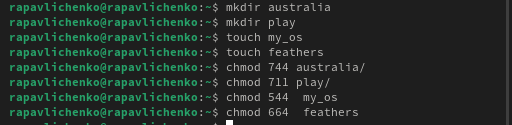
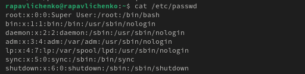
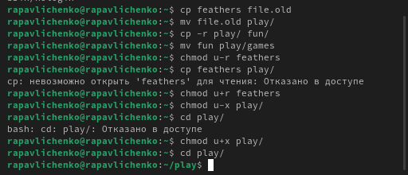
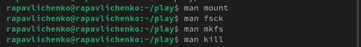

---
## Front matter
lang: ru-RU
title: Лабораторная работа № 7
subtitle: Анализ файловой системы Linux. Команды для работы с файлами и каталогами
author:
  - Павличенко Родион Андреевич
institute:
  - Российский университет дружбы народов, Москва, Россия

## i18n babel
babel-lang: russian
babel-otherlangs: english

## Formatting pdf
toc: false
toc-title: Содержание
slide_level: 2
aspectratio: 169
section-titles: true
theme: metropolis
header-includes:
 - \metroset{progressbar=frametitle,sectionpage=progressbar,numbering=fraction}
---

# Информация

## Докладчик

:::::::::::::: {.columns align=center}
::: {.column width="70%"}

  * Павличенко Родион Андреевич
  * студент
  * Российский университет дружбы народов
  * [1132246838@pfur.ru](mailto:1132246838@pfur.ru)
  
:::
::: {.column width="30%"}

:::
::::::::::::::

# Выполнение лабораторной работы

## Выполняем все примеры, приведённые в первой части описания лабораторной работы

:::::::::::::: {.columns align=center}
::: {.column width="30%"}

:::
::::::::::::::

## Скопировали файл /usr/include/sys/io.h в домашний каталог и назвали его equipment. В домашнем каталоге создали директорию ~/ski.plases. Переместили файл equipment в каталог ~/ski.plases. Переименовали файл ~/ski.plases/equipment в ~/ski.plases/equiplist.  Создали в домашнем каталоге файл abc1 и скопировали его в каталог ~/ski.plases, назвали его equiplist2. Создали каталог с именем equipment в каталоге ~/ski.plases.  Переместили файлы ~/ski.plases/equiplist и equiplist2 в каталог ~/ski.plases/equipment. Создали и переместили каталог ~/newdir в каталог ~/ski.plases и назвали его plans

:::::::::::::: {.columns align=center}
::: {.column width="30%"}

:::
::::::::::::::

## Присвоили двум дерикториям и двум  файлам права доступа, перед этим создав файлы

:::::::::::::: {.columns align=center}
::: {.column width="30%"}

:::
::::::::::::::

## Просмотрели содержимое файла /etc/password.
:::::::::::::: {.columns align=center}
::: {.column width="30%"}

:::
::::::::::::::

## Скопировали файл ~/feathers в файл ~/file.old Переместили файл ~/file.old в каталог ~/play. Скопировали каталог ~/play в каталог ~/fun. Переместили каталог ~/fun в каталог ~/play и назвали его games. Лишили владельца файла ~/feathers права на чтение. Попробовали просмотреть файл ~/feathers командой Cat – не вышло. Дали владельцу файла ~/feathers право на чтение. Лишили владельца каталога ~/play права на выполнение. Перешли в каталог ~/play – не вышло. Дайте владельцу каталога ~/play право на выполнение.

:::::::::::::: {.columns align=center}
::: {.column width="30%"}

:::
::::::::::::::

## Прочитали man по командам mount, fsck, mkfs, kill

:::::::::::::: {.columns align=center}
::: {.column width="30%"}

:::
::::::::::::::

## Mount

:::::::::::::: {.columns align=center}
::: {.column width="30%"}

mount – используется для подключения (монтирования) файловых систем к определенным точкам в файловой системе. Позволяет монтировать устройства, сетевые ресурсы и другие файловые системы. 

:::
::::::::::::::

## fsck

:::::::::::::: {.columns align=center}
::: {.column width="30%"}

fsck – утилита для проверки и исправления ошибок в файловых системах. Применяется для диагностики и восстановления поврежденных структур файловых систем. 

:::
::::::::::::::

## mkfs

:::::::::::::: {.columns align=center}
::: {.column width="30%"}

mkfs – команда для создания новой файловой системы на диске или разделе. Поддерживает различные типы файловых систем, такие как ext4, xfs, vfat и другие. 

:::
::::::::::::::

## kill

:::::::::::::: {.columns align=center}
::: {.column width="30%"}

kill – используется для завершения процессов по их идентификатору (PID). Позволяет отправлять разные сигналы процессам, включая `SIGTERM` (мягкое завершение) и `SIGKILL` (принудительное завершение).

:::
::::::::::::::

## Вывод

Мы ознакомились с файловой системой Linux, её структурой, именами и содержанием
каталогов. Приобрели практических навыков по применению команд для работы
с файлами и каталогами, по управлению процессами (и работами), по проверке использования диска и обслуживанию файловой системы.
