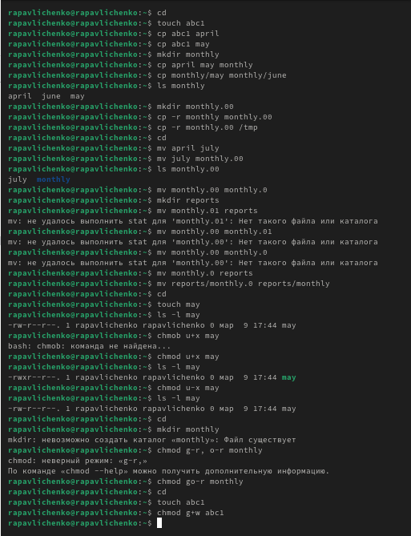
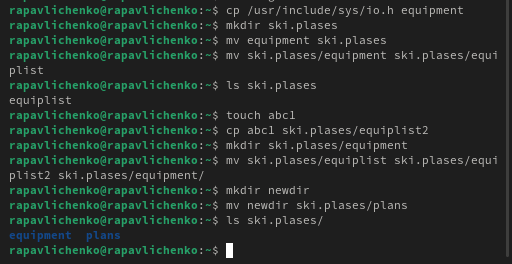
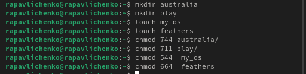
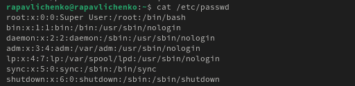
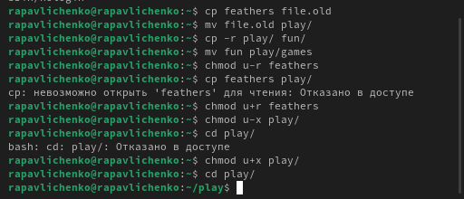
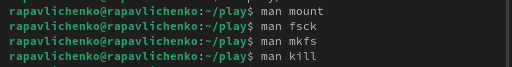

---
## Front matter
title: "Лабораторная работа № 7"
subtitle: "Анализ файловой системы Linux.Команды для работы с файлами и каталогами"
author: "Павличенко Родион Андреевич"

## Generic otions
lang: ru-RU
toc-title: "Содержание"

## Bibliography
bibliography: bib/cite.bib
csl: pandoc/csl/gost-r-7-0-5-2008-numeric.csl

## Pdf output format
toc: true # Table of contents
toc-depth: 2
lof: true # List of figures
lot: true # List of tables
fontsize: 12pt
linestretch: 1.5
papersize: a4
documentclass: scrreprt
## I18n polyglossia
polyglossia-lang:
  name: russian
  options:
	- spelling=modern
	- babelshorthands=true
polyglossia-otherlangs:
  name: english
## I18n babel
babel-lang: russian
babel-otherlangs: english
## Fonts
mainfont: IBM Plex Serif
romanfont: IBM Plex Serif
sansfont: IBM Plex Sans
monofont: IBM Plex Mono
mathfont: STIX Two Math
mainfontoptions: Ligatures=Common,Ligatures=TeX,Scale=0.94
romanfontoptions: Ligatures=Common,Ligatures=TeX,Scale=0.94
sansfontoptions: Ligatures=Common,Ligatures=TeX,Scale=MatchLowercase,Scale=0.94
monofontoptions: Scale=MatchLowercase,Scale=0.94,FakeStretch=0.9
mathfontoptions:
## Biblatex
biblatex: true
biblio-style: "gost-numeric"
biblatexoptions:
  - parentracker=true
  - backend=biber
  - hyperref=auto
  - language=auto
  - autolang=other*
  - citestyle=gost-numeric
## Pandoc-crossref LaTeX customization
figureTitle: "Рис."
tableTitle: "Таблица"
listingTitle: "Листинг"
lofTitle: "Список иллюстраций"
lotTitle: "Список таблиц"
lolTitle: "Листинги"
## Misc options
indent: true
header-includes:
  - \usepackage{indentfirst}
  - \usepackage{float} # keep figures where there are in the text
  - \floatplacement{figure}{H} # keep figures where there are in the text
---

# Цель работы

Ознакомление с файловой системой Linux, её структурой, именами и содержанием каталогов. Приобретение практических навыков по применению команд для работы с файлами и каталогами, по управлению процессами (и работами), по проверке использования диска и обслуживанию файловой системы

# Выполнение лабораторной работы

Выполняем все примеры, приведённые в первой части описания лабораторной работы

{#fig:001 width=70%}

Скопировали файл /usr/include/sys/io.h в домашний каталог и назвали его equipment. В домашнем каталоге создали директорию ~/ski.plases. Переместили файл equipment в каталог ~/ski.plases. Переименовали файл ~/ski.plases/equipment в ~/ski.plases/equiplist.  Создали в домашнем каталоге файл abc1 и скопировали его в каталог ~/ski.plases, назвали его equiplist2. Создали каталог с именем equipment в каталоге ~/ski.plases.  Переместили файлы ~/ski.plases/equiplist и equiplist2 в каталог ~/ski.plases/equipment. Создали и переместили каталог ~/newdir в каталог ~/ski.plases и назвали его plans

{#fig:002 width=70%}

Присвоили двум дерикториям и двум  файлам права доступа, перед этим создав файлы

{#fig:003 width=70%}

Просмотрели содержимое файла /etc/password.

{#fig:004 width=70%}
 
Скопировали файл ~/feathers в файл ~/file.old Переместили файл ~/file.old в каталог ~/play. Скопировали каталог ~/play в каталог ~/fun. Переместили каталог ~/fun в каталог ~/play и назвали его games. Лишили владельца файла ~/feathers права на чтение. Попробовали просмотреть файл ~/feathers командой Cat – не вышло. Дали владельцу файла ~/feathers право на чтение. Лишили владельца каталога ~/play права на выполнение. Перешли в каталог ~/play – не вышло. Дайте владельцу каталога ~/play право на выполнение.
{#fig:005 width=70%}

Прочитали man по командам mount, fsck, mkfs, kill
{#fig:006 width=70%}

1. mount – используется для подключения (монтирования) файловых систем к определенным точкам в файловой системе. Позволяет монтировать устройства, сетевые ресурсы и другие файловые системы. 

2. fsck – утилита для проверки и исправления ошибок в файловых системах. Применяется для диагностики и восстановления поврежденных структур файловых систем. 

3. mkfs – команда для создания новой файловой системы на диске или разделе. Поддерживает различные типы файловых систем, такие как ext4, xfs, vfat и другие. 

4. kill – используется для завершения процессов по их идентификатору (PID). Позволяет отправлять разные сигналы процессам, включая `SIGTERM` (мягкое завершение) и `SIGKILL` (принудительное завершение).

# Контрольные вопросы

1.Характеристика файловых систем 
Файловая система определяет способ хранения и управления данными на диске. Основные файловые системы в Linux: 

   - ext4 – современная файловая система Linux с поддержкой журналирования, больших файлов и высокой производительности. 
  
 - XFS – высокопроизводительная файловая система, оптимизированная для работы с большими объемами данных. 
  
- Btrfs – поддерживает снапшоты, дедупликацию и самовосстановление данных. 
   
- vfat – используется для совместимости с Windows и внешними носителями. 

2. Общая структура файловой системы Linux и её основные директории
  
   - `/` – корневая директория, содержит всю файловую систему. 
 
  - `/bin` – исполняемые файлы базовых команд. 

   - `/sbin` – системные утилиты для администратора. 

   - `/etc` – файлы конфигурации системы. 

   - `/home` – домашние каталоги пользователей. 

   - `/var` – файлы логов, временные данные, очереди заданий. 

   - `/tmp` – временные файлы. 
   
   - `/usr` – вторичные программы и утилиты. 

   - `/mnt` и `/media` – точки монтирования внешних носителей. 

3. Операция для доступа к содержимому файловой системы
 
Чтобы содержимое файловой системы стало доступным операционной системе, необходимо её смонтировать с помощью команды `mount`. 

4. Причины нарушения целостности файловой системы и способы устранения повреждений

Основные причины: внезапное отключение питания, аппаратные сбои, программные ошибки, некорректное завершение работы системы. Для исправления повреждений используется команда `fsck`. 

5. Создание файловой системы

Файловая система создается с помощью команды `mkfs`, например, `mkfs.ext4 /dev/sdX`. 

6. Команды для просмотра текстовых файлов

   - `cat` – выводит содержимое файла целиком. 

   - `less` – позволяет прокручивать файл постранично. 

   - `more` – аналог `less`, но с меньшей функциональностью. 

   - `head` – показывает первые строки файла. 

   - `tail` – показывает последние строки файла. 

7. Основные возможности команды `cp`
 
   - `cp file1 file2` – копирование файла. 

   - `cp -r dir1 dir2` – рекурсивное копирование каталога. 

   - `cp -i file1 file2` – запрос перед перезаписью. 

   - `cp -u file1 file2` – копирование только если источник новее. 

   - `cp -v file1 file2` – отображение информации о копировании.

# Выводы

Мы ознакомились с файловой системой Linux, её структурой, именами и содержанием каталогов. Приобрели практических навыков по применению команд для работы с файлами и каталогами, по управлению процессами (и работами), по проверке использования диска и обслуживанию файловой системы.

