---
## Front matter
lang: ru-RU
title: Лабораторная работа № 8
subtitle: Поиск файлов. Перенаправление ввода-вывода. Просмотр запущенных процессов

author:
  - Павличенко Родион Андреевич
institute:
  - Российский университет дружбы народов, Москва, Россия

## i18n babel
babel-lang: russian
babel-otherlangs: english

## Formatting pdf
toc: false
toc-title: Содержание
slide_level: 2
aspectratio: 169
section-titles: true
theme: metropolis
header-includes:
 - \metroset{progressbar=frametitle,sectionpage=progressbar,numbering=fraction}
---

# Информация

## Докладчик

:::::::::::::: {.columns align=center}
::: {.column width="70%"}

  * Павличенко Родион Андреевич
  * студент
  * Российский университет дружбы народов
  * [1132246838@pfur.ru](mailto:1132246838@pfur.ru)
  
:::
::: {.column width="30%"}

:::
::::::::::::::

# Выполнение лабораторной работы

## Осуществим вход в систему, используя соответствующее имя пользователя. Запишим в файл file.txt названия файлов, содержащихся в каталоге /etc. Допишим в этот же файл названия файлов, содержащихся в домашнем каталоге.

:::::::::::::: {.columns align=center}
::: {.column width="30%"}

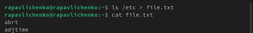
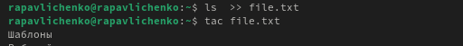

:::
::::::::::::::

## Вывели имена всех файлов из file.txt, имеющих расширение .conf, после чего записали их в новый текстовой файл conf.txt.

:::::::::::::: {.columns align=center}
::: {.column width="30%"}

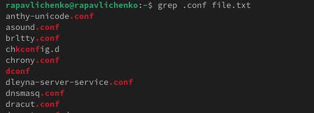
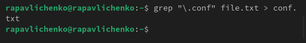

:::
::::::::::::::

## Найдем файлы, начинающиеcя с “c”

:::::::::::::: {.columns align=center}
::: {.column width="30%"}

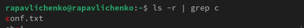

:::
::::::::::::::

## Найдем файлы, начинающиеcя с “h”

:::::::::::::: {.columns align=center}
::: {.column width="30%"}

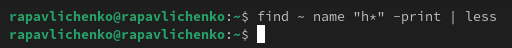

:::
::::::::::::::

## Запустили в фоновом режиме процесс, который будет записывать в файл ~/logfile файлы, имена которых начинаются с log. Удалили файл ~/logfile.

:::::::::::::: {.columns align=center}
::: {.column width="30%"}

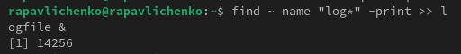

:::
::::::::::::::

## Запустили из консоли в фоновом режиме редактор gedit и определение его id.

:::::::::::::: {.columns align=center}
::: {.column width="30%"}

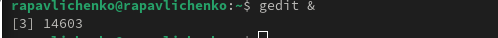
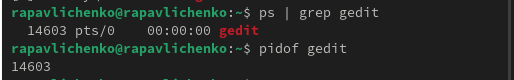

:::
::::::::::::::

## Прочли справку (man) команды kill, после чего использовали её для завершения процесса gedit.

:::::::::::::: {.columns align=center}
::: {.column width="30%"}

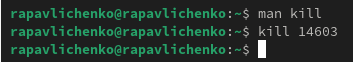

:::
::::::::::::::

## Выполнили команды df и du, предварительно получив более подробную информацию об этих командах, с помощью команды man.

:::::::::::::: {.columns align=center}
::: {.column width="30%"}

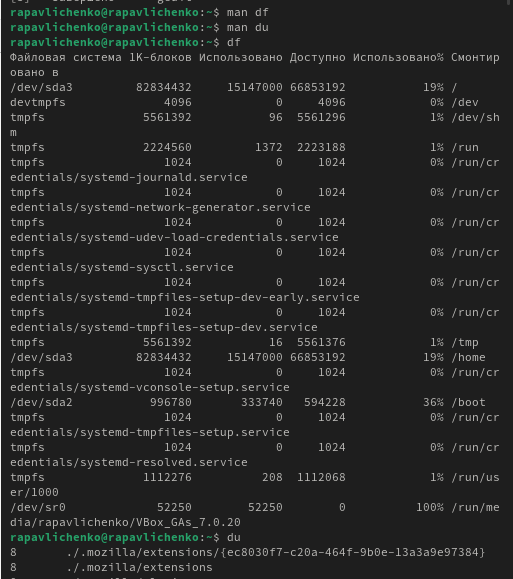

:::
::::::::::::::

## Выводим имена всех директорий

:::::::::::::: {.columns align=center}
::: {.column width="30%"}

:::
::::::::::::::

## Вывод

Мы ознакомились с инструментами поиска файлов и фильтрации текстовых данных. Приобрели практические навыки: по управлению процессами (и заданиями), по проверке использования диска и обслуживанию файловых систем.

