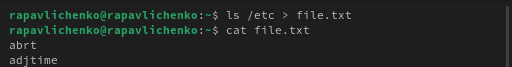
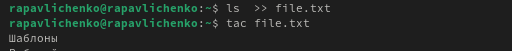
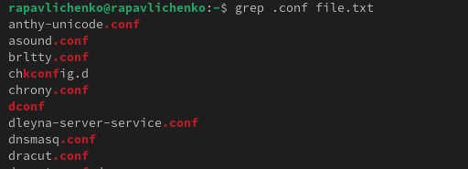
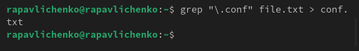
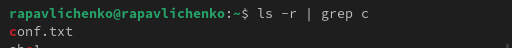
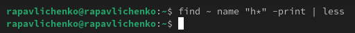
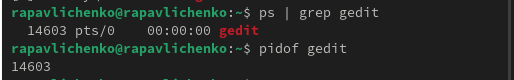
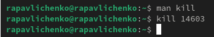
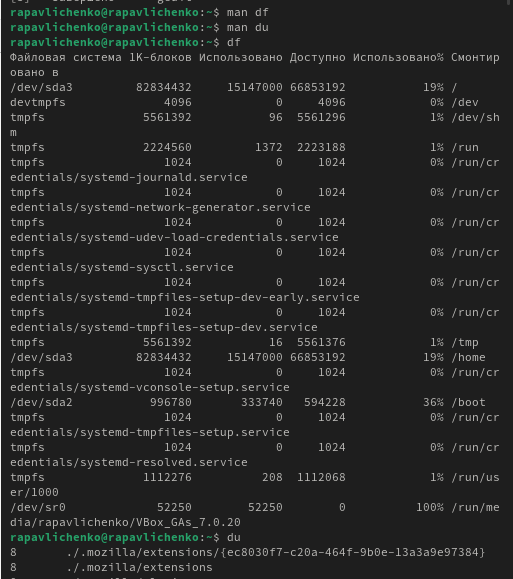

---
## Front matter
title: "Лабораторная работа № 8"
subtitle: "Поиск файлов. Перенаправление ввода-вывода. Просмотр запущенных процессов"
author: "Павличенко Родион Андреевич"

## Generic otions
lang: ru-RU
toc-title: "Содержание"

## Bibliography
bibliography: bib/cite.bib
csl: pandoc/csl/gost-r-7-0-5-2008-numeric.csl

## Pdf output format
toc: true # Table of contents
toc-depth: 2
lof: true # List of figures
lot: true # List of tables
fontsize: 12pt
linestretch: 1.5
papersize: a4
documentclass: scrreprt
## I18n polyglossia
polyglossia-lang:
  name: russian
  options:
	- spelling=modern
	- babelshorthands=true
polyglossia-otherlangs:
  name: english
## I18n babel
babel-lang: russian
babel-otherlangs: english
## Fonts
mainfont: IBM Plex Serif
romanfont: IBM Plex Serif
sansfont: IBM Plex Sans
monofont: IBM Plex Mono
mathfont: STIX Two Math
mainfontoptions: Ligatures=Common,Ligatures=TeX,Scale=0.94
romanfontoptions: Ligatures=Common,Ligatures=TeX,Scale=0.94
sansfontoptions: Ligatures=Common,Ligatures=TeX,Scale=MatchLowercase,Scale=0.94
monofontoptions: Scale=MatchLowercase,Scale=0.94,FakeStretch=0.9
mathfontoptions:
## Biblatex
biblatex: true
biblio-style: "gost-numeric"
biblatexoptions:
  - parentracker=true
  - backend=biber
  - hyperref=auto
  - language=auto
  - autolang=other*
  - citestyle=gost-numeric
## Pandoc-crossref LaTeX customization
figureTitle: "Рис."
tableTitle: "Таблица"
listingTitle: "Листинг"
lofTitle: "Список иллюстраций"
lotTitle: "Список таблиц"
lolTitle: "Листинги"
## Misc options
indent: true
header-includes:
  - \usepackage{indentfirst}
  - \usepackage{float} # keep figures where there are in the text
  - \floatplacement{figure}{H} # keep figures where there are in the text
---

# Цель работы

Ознакомление с инструментами поиска файлов и фильтрации текстовых данных. Приобретение практических навыков: по управлению процессами (и заданиями), по проверке использования диска и обслуживанию файловых систем.

# Выполнение лабораторной работы

Осуществим вход в систему, используя соответствующее имя пользователя. Запишим в файл file.txt названия файлов, содержащихся в каталоге /etc. Допишим в этот же файл названия файлов, содержащихся в домашнем каталоге.

{#fig:001 width=70%}

{#fig:002 width=70%}

Вывели имена всех файлов из file.txt, имеющих расширение .conf, после чего записали их в новый текстовой файл conf.txt.

{#fig:003 width=70%}

{#fig:004 width=70%}

Найдем файлы, начинающиемя с “c”

{#fig:005 width=70%}

Найдем файлы, начинающиемя с “h”

{#fig:006 width=70%}

Запустили в фоновом режиме процесс, который будет записывать в файл ~/logfile файлы, имена которых начинаются с log. Удалили файл ~/logfile.

{#fig:008 width=70%}

Запустили из консоли в фоновом режиме редактор gedit и определение его id.

{#fig:009 width=70%}
{#fig:010 width=70%}

Прочли справку (man) команды kill, после чего использовали её для завершения процесса gedit.

{#fig:011 width=70%}

Выполнили команды df и du, предварительно получив более подробную информацию об этих командах, с помощью команды man.

{#fig:012 width=70%}

Выводим имена всех директорий

{#fig:013 width=70%}

# Контрольный вопросы

1. Существуют три основных потока ввода-вывода: стандартный ввод (stdin, дескриптор 0), стандартный вывод (stdout, дескриптор 1) и стандартный поток ошибок (stderr, дескриптор 2). 

2. Операция `>` используется для перезаписи содержимого файла, тогда как `>>` добавляет данные в конец файла, не удаляя его текущее содержимое. 

3. Конвейер (pipeline) – это способ передачи вывода одной команды в качестве ввода для другой с использованием символа `|`, что позволяет объединять несколько команд в цепочку обработки данных. 

4. Процесс – это запущенный экземпляр программы с собственным адресным пространством и состоянием выполнения. Программа – это просто файл на диске, содержащий исполняемый код, а процесс является активным выполнением этой программы в памяти. 

5. PID (Process ID) – уникальный идентификатор процесса в системе. GID (Group ID) – идентификатор группы пользователей, который определяет права доступа в многопользовательской системе. 

6. Задачи – это процессы, выполняющиеся в фоновом или приостановленном режиме. Управление задачами осуществляется с помощью команды `jobs`, а также команд `fg`, `bg` и `kill` для возобновления или завершения задач. 

7. Утилита `top` отображает динамическую информацию о запущенных процессах, загрузке процессора и потреблении памяти. `htop` – это более удобная и наглядная альтернатива `top`, предоставляющая цветовую разметку и возможность управления процессами с помощью клавиш. 

8. Для поиска файлов используется команда `find`. Она позволяет искать файлы по имени, типу, размеру и другим параметрам. Примеры: `find /home -name "file.txt"`, `find /var -size +100M`, `find /etc -type d` (поиск директорий). 

9. Найти файл по его содержимому можно с помощью команды `grep`. Например, `grep "поиск" /home/user/*.txt` ищет слово "поиск" во всех `.txt` файлах в указанной директории. 

10. Определить объем свободного места на диске можно с помощью команды `df -h`, которая показывает информацию в удобном для чтения формате. 

11. Определить объем домашнего каталога можно с помощью команды `du -sh ~/`, которая выводит общий размер каталога в человекочитаемом формате. 

12. Удалить зависший процесс можно с помощью команды `kill PID`, где `PID` – идентификатор процесса. Если процесс не завершается, можно использовать `kill -9 PID` для принудительного завершения.

# Выводы

Мы ознакомились с инструментами поиска файлов и фильтрации текстовых данных. Приобрели практические навыки: по управлению процессами (и заданиями), по проверке использования диска и обслуживанию файловых систем.

