---
## Front matter
lang: ru-RU
title: Лабораторная работа № 9 
subtitle: Командная оболочка Midnight Commander
author:
  - Павличенко Родион Андреевич
institute:
  - Российский университет дружбы народов, Москва, Россия

## i18n babel
babel-lang: russian
babel-otherlangs: english

## Formatting pdf
toc: false
toc-title: Содержание
slide_level: 2
aspectratio: 169
section-titles: true
theme: metropolis
header-includes:
 - \metroset{progressbar=frametitle,sectionpage=progressbar,numbering=fraction}
---

# Информация

## Докладчик

:::::::::::::: {.columns align=center}
::: {.column width="70%"}

  * Павличенко Родион Андреевич
  * студент
  * Российский университет дружбы народов
  * [1132246838@pfur.ru](mailto:1132246838@pfur.ru)
  
:::
::: {.column width="30%"}

:::
::::::::::::::

# Выполнение лабораторной работы

## Изучаем информацию о mc, вызвав в командной строке man mc

:::::::::::::: {.columns align=center}
::: {.column width="30%"}

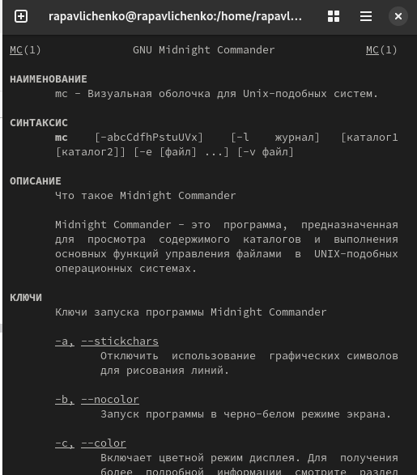

:::
::::::::::::::

## Запустили из командной строки mc, изучили его структуру и меню

:::::::::::::: {.columns align=center}
::: {.column width="30%"}

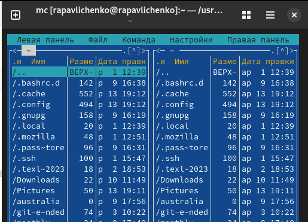

:::
::::::::::::::

## Выполняем несколько операций в mc, используя управляющие клавиши (операции с панелями; выделение/отмена выделения файлов, копирование/перемещение файлов, получение информации о размере и правах доступа на файлы и/или каталоги и т.п.)

:::::::::::::: {.columns align=center}
::: {.column width="30%"}

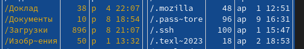
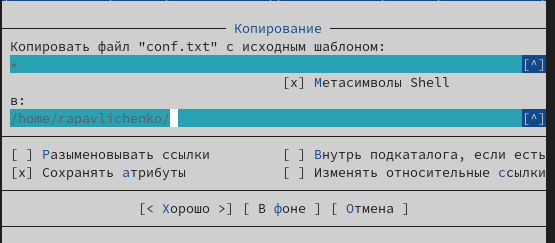

:::
::::::::::::::

## Выполняем основные команды меню правой панели
:::::::::::::: {.columns align=center}
::: {.column width="30%"}

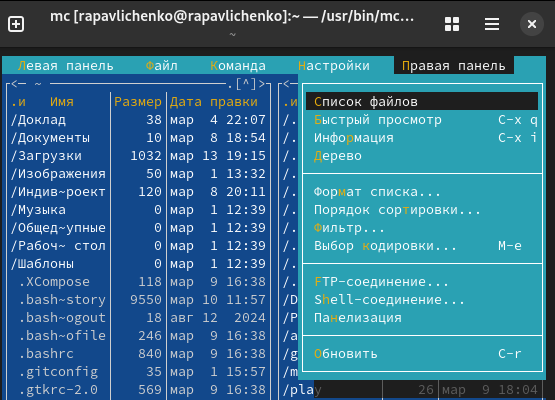

:::
::::::::::::::

## Используя возможности подменю Файл , выполнители следующие команды:  просмотр содержимого текстового файла; редактирование содержимого текстового файла (без сохранения результатов редактирования); создание каталога; копирование в файлов в созданный каталог

:::::::::::::: {.columns align=center}
::: {.column width="30%"}

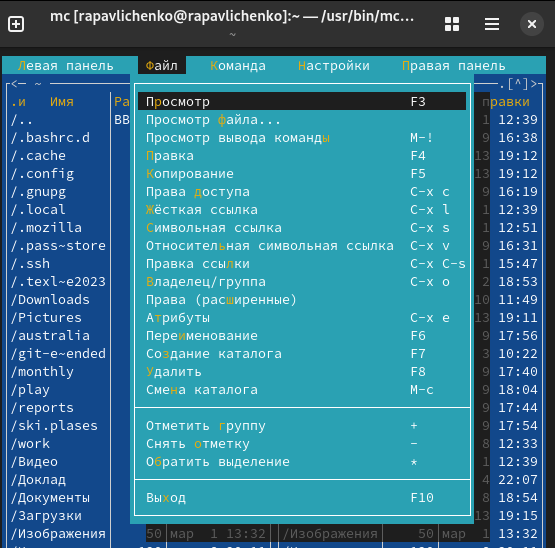

:::
::::::::::::::

## Вызвали подменю Настройки . Освоили операции, определяющие структуру экрана mc

:::::::::::::: {.columns align=center}
::: {.column width="30%"}

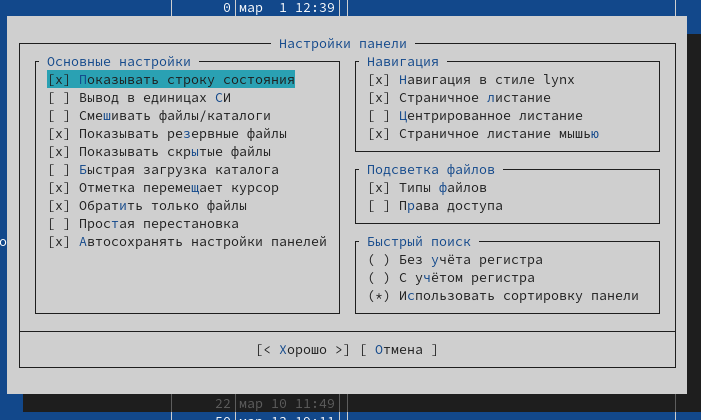

:::
::::::::::::::

## Создали текстовой файл text.txt

:::::::::::::: {.columns align=center}
::: {.column width="30%"}

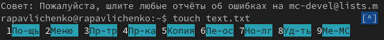

:::
::::::::::::::

## Открыли этот файл с помощью встроенного в mc редактора. Вставили в открытый файл небольшой фрагмент текста

:::::::::::::: {.columns align=center}
::: {.column width="30%"}

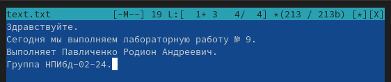

:::
::::::::::::::

## Проделали е с текстом манипуляции, используя горячие клавиши. Сохранили файл.

:::::::::::::: {.columns align=center}
::: {.column width="30%"}

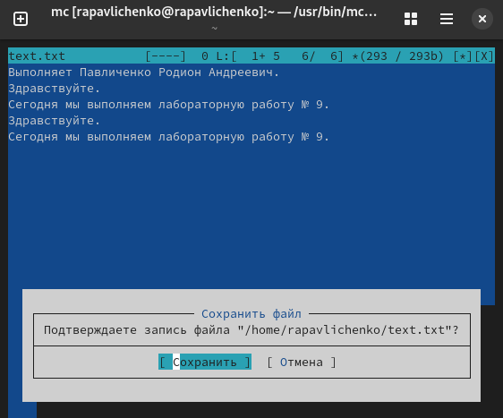

:::
::::::::::::::

## Нашли файл С и включили подсветку синтаксиса

:::::::::::::: {.columns align=center}
::: {.column width="30%"}

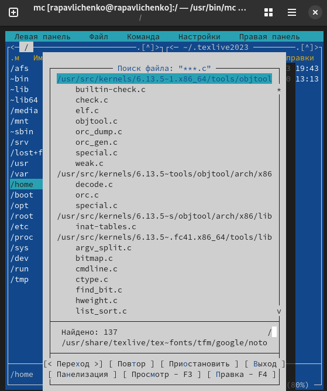
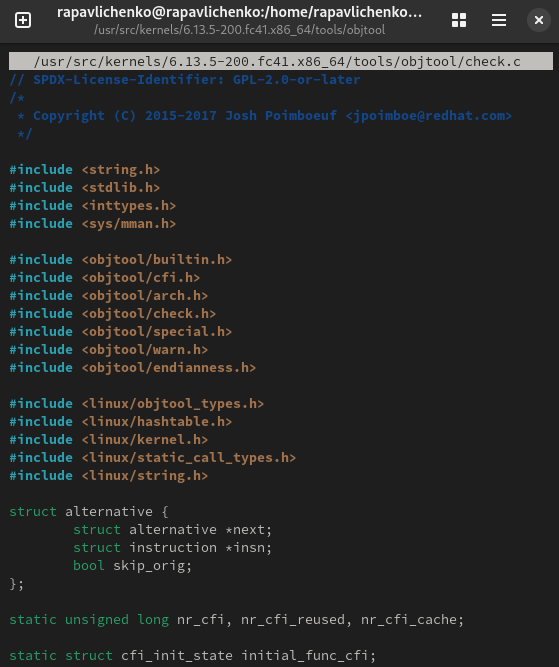

:::
::::::::::::::

## Вывод
Освоили основные возможности командной оболочки Midnight Commander. Приобрели навыков практической работы по просмотру каталогов и файлов; манипуляций с ними.ц

