---
## Front matter
title: "Лабораторная работа № 9"
subtitle: "Командная оболочка Midnight Commander"
author: "Павличенко Родион Андреевич"

## Generic otions
lang: ru-RU
toc-title: "Содержание"

## Bibliography
bibliography: bib/cite.bib
csl: pandoc/csl/gost-r-7-0-5-2008-numeric.csl

## Pdf output format
toc: true # Table of contents
toc-depth: 2
lof: true # List of figures
lot: true # List of tables
fontsize: 12pt
linestretch: 1.5
papersize: a4
documentclass: scrreprt
## I18n polyglossia
polyglossia-lang:
  name: russian
  options:
	- spelling=modern
	- babelshorthands=true
polyglossia-otherlangs:
  name: english
## I18n babel
babel-lang: russian
babel-otherlangs: english
## Fonts
mainfont: IBM Plex Serif
romanfont: IBM Plex Serif
sansfont: IBM Plex Sans
monofont: IBM Plex Mono
mathfont: STIX Two Math
mainfontoptions: Ligatures=Common,Ligatures=TeX,Scale=0.94
romanfontoptions: Ligatures=Common,Ligatures=TeX,Scale=0.94
sansfontoptions: Ligatures=Common,Ligatures=TeX,Scale=MatchLowercase,Scale=0.94
monofontoptions: Scale=MatchLowercase,Scale=0.94,FakeStretch=0.9
mathfontoptions:
## Biblatex
biblatex: true
biblio-style: "gost-numeric"
biblatexoptions:
  - parentracker=true
  - backend=biber
  - hyperref=auto
  - language=auto
  - autolang=other*
  - citestyle=gost-numeric
## Pandoc-crossref LaTeX customization
figureTitle: "Рис."
tableTitle: "Таблица"
listingTitle: "Листинг"
lofTitle: "Список иллюстраций"
lotTitle: "Список таблиц"
lolTitle: "Листинги"
## Misc options
indent: true
header-includes:
  - \usepackage{indentfirst}
  - \usepackage{float} # keep figures where there are in the text
  - \floatplacement{figure}{H} # keep figures where there are in the text
---

# Цель работы

Освоение основных возможностей командной оболочки Midnight Commander. Приобретение навыков практической работы по просмотру каталогов и файлов; манипуляций с ними.

# Выполнение лабораторной работы

Изучаем информацию о mc, вызвав в командной строке man mc

{#fig:001 width=70%}

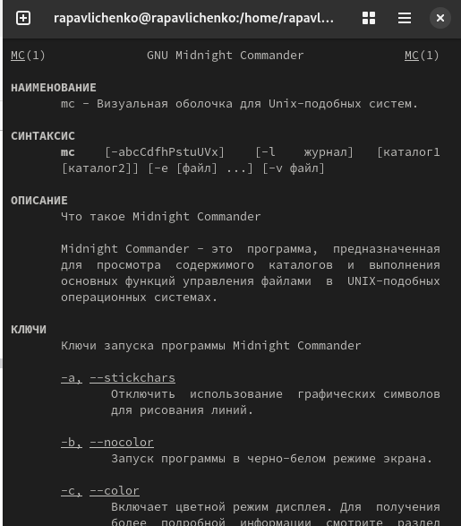{#fig:002 width=70%}

Запустили из командной строки mc, изучили его структуру и меню
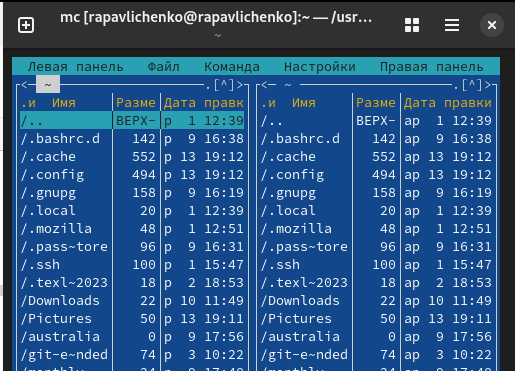{#fig:003 width=70%}

Выполняем несколько операций в mc, используя управляющие клавиши (операции с панелями; выделение/отмена выделения файлов, копирование/перемещение файлов, получение информации о размере и правах доступа на файлы и/или каталоги и т.п.)

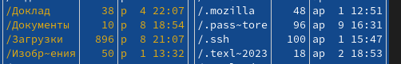{#fig:004 width=70%}

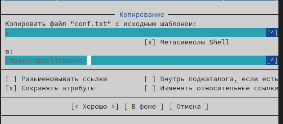{#fig:005 width=70%}

Выполняем основные команды меню правой панели
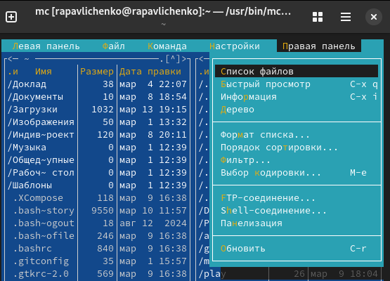{#fig:006 width=70%}

Используя возможности подменю Файл , выполнители следующие команды:  просмотр содержимого текстового файла; редактирование содержимого текстового файла (без сохранения результатов редактирования); создание каталога; копирование в файлов в созданный каталог
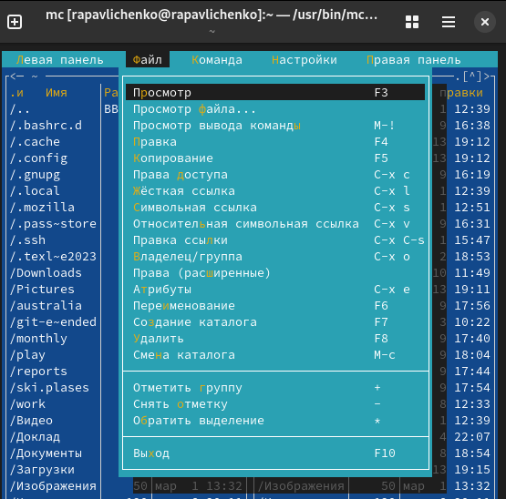{#fig:007 width=70%}

Вызвали подменю Настройки . Освоили операции, определяющие структуру экрана mc
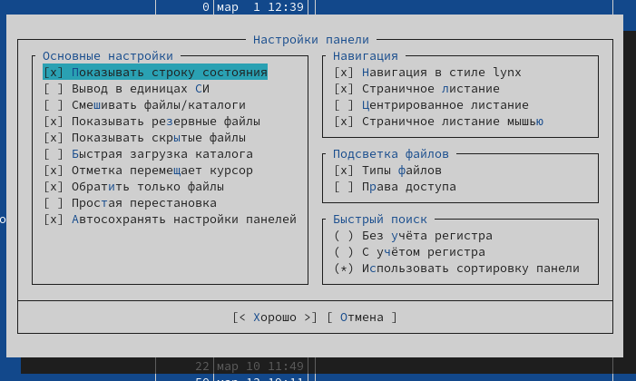{#fig:008 width=70%}

Создали текстовой файл text.txt
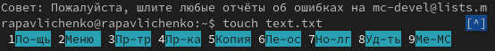{#fig:009 width=70%}

Открыли этот файл с помощью встроенного в mc редактора. Вставили в открытый файл небольшой фрагмент текста
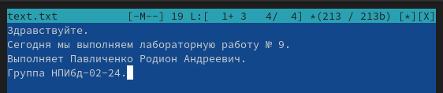{#fig:010 width=70%}

Проделали е с текстом манипуляции, используя горячие клавиши. Сохранили файл.
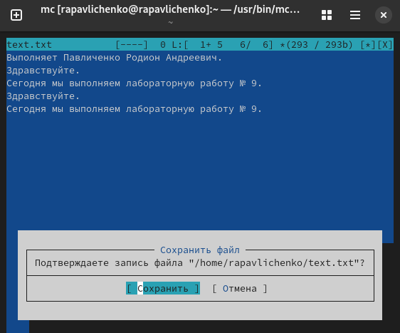{#fig:011 width=70%}

Нашли файл С и включили подсветку синтаксиса

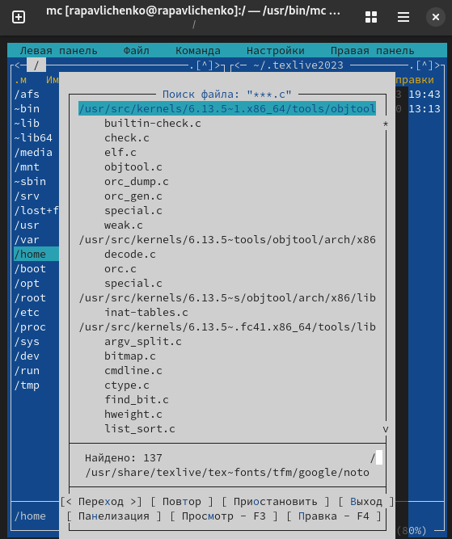{#fig:012 width=70%}

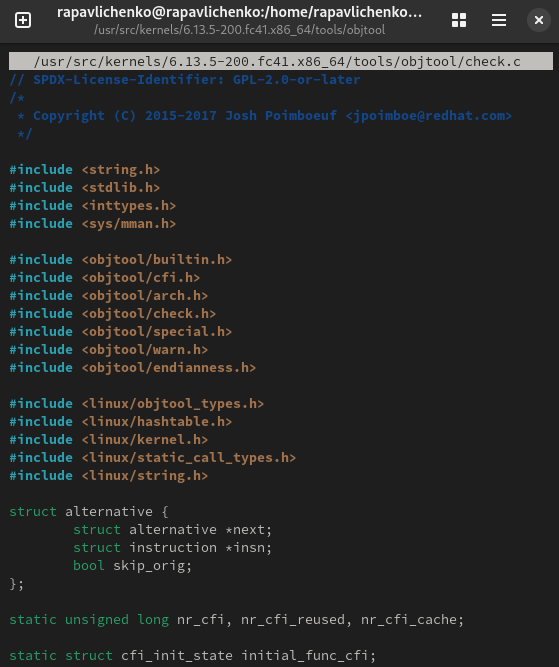{#fig:013 width=70%}

# Выводы

Освоили основные возможности командной оболочки Midnight Commander. Приобрели навыков практической работы по просмотру каталогов и файлов; манипуляций с ними.ц

