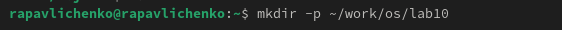
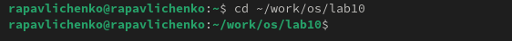
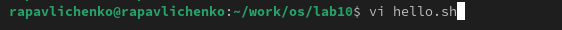
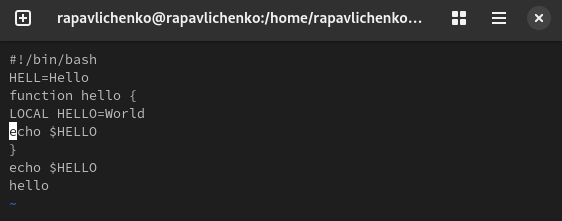
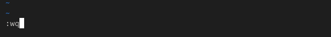
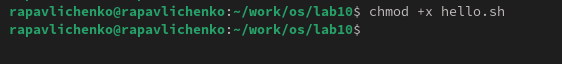
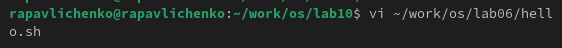
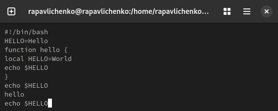
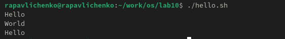

---
## Front matter
lang: ru-RU
title: Лабораторная работа № 10
subtitle: Текстовой редактор vi
author:
  - Павличенко Родион Андреевич
institute:
  - Российский университет дружбы народов, Москва, Россия

## i18n babel
babel-lang: russian
babel-otherlangs: english

## Formatting pdf
toc: false
toc-title: Содержание
slide_level: 2
aspectratio: 169
section-titles: true
theme: metropolis
header-includes:
 - \metroset{progressbar=frametitle,sectionpage=progressbar,numbering=fraction}
---

# Информация

## Докладчик

:::::::::::::: {.columns align=center}
::: {.column width="70%"}

  * Павличенко Родион Андреевич
  * студент
  * Российский университет дружбы народов
  * [1132246838@pfur.ru](mailto:1132246838@pfur.ru)
  
:::
::: {.column width="30%"}

:::
::::::::::::::

# Выполнение лабораторной работы

## Создали каталог с именем ~/work/os/lab=10. Перешли во вновь созданный каталог. Вызвали vi и создали файл hello.sh

:::::::::::::: {.columns align=center}
::: {.column width="30%"}

:::
::::::::::::::

## Вставили текст, проделали некоторые операции, записали и вышли.

:::::::::::::: {.columns align=center}
::: {.column width="30%"}

:::
::::::::::::::

## Сделали файл исполняемым командой chmod +x hello.sh

:::::::::::::: {.columns align=center}
::: {.column width="30%"}

:::
::::::::::::::

## Вызвали vi на редактирование файла vi ~/work/os/lab06/hello.sh
:::::::::::::: {.columns align=center}
::: {.column width="30%"}

:::
::::::::::::::

## Выполнение команд в файле hello.sh

:::::::::::::: {.columns align=center}
::: {.column width="30%"}

:::
::::::::::::::

## Выполнение hello.sh

:::::::::::::: {.columns align=center}
::: {.column width="30%"}

:::
::::::::::::::

## Вывод

Познакомились с операционной системой Linux. Получили практические навыки работы с редактором vi, установленным по умолчанию практически во всех дистрибутивах

