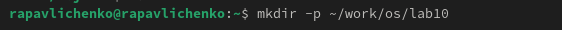
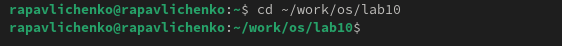
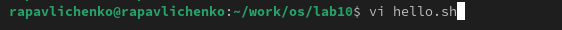
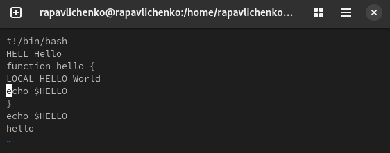
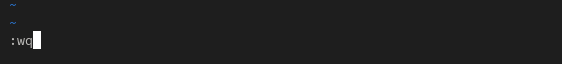
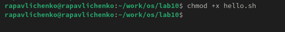
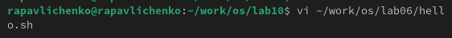
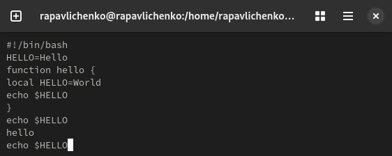
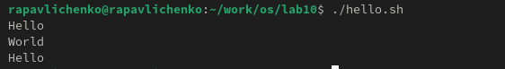

---
## Front matter
title: "Лабораторная работа № 10"
subtitle: "Текстовой редактор vi"
author: "Павличенко Родион Андреевич"

## Generic otions
lang: ru-RU
toc-title: "Содержание"

## Bibliography
bibliography: bib/cite.bib
csl: pandoc/csl/gost-r-7-0-5-2008-numeric.csl

## Pdf output format
toc: true # Table of contents
toc-depth: 2
lof: true # List of figures
lot: true # List of tables
fontsize: 12pt
linestretch: 1.5
papersize: a4
documentclass: scrreprt
## I18n polyglossia
polyglossia-lang:
  name: russian
  options:
	- spelling=modern
	- babelshorthands=true
polyglossia-otherlangs:
  name: english
## I18n babel
babel-lang: russian
babel-otherlangs: english
## Fonts
mainfont: IBM Plex Serif
romanfont: IBM Plex Serif
sansfont: IBM Plex Sans
monofont: IBM Plex Mono
mathfont: STIX Two Math
mainfontoptions: Ligatures=Common,Ligatures=TeX,Scale=0.94
romanfontoptions: Ligatures=Common,Ligatures=TeX,Scale=0.94
sansfontoptions: Ligatures=Common,Ligatures=TeX,Scale=MatchLowercase,Scale=0.94
monofontoptions: Scale=MatchLowercase,Scale=0.94,FakeStretch=0.9
mathfontoptions:
## Biblatex
biblatex: true
biblio-style: "gost-numeric"
biblatexoptions:
  - parentracker=true
  - backend=biber
  - hyperref=auto
  - language=auto
  - autolang=other*
  - citestyle=gost-numeric
## Pandoc-crossref LaTeX customization
figureTitle: "Рис."
tableTitle: "Таблица"
listingTitle: "Листинг"
lofTitle: "Список иллюстраций"
lotTitle: "Список таблиц"
lolTitle: "Листинги"
## Misc options
indent: true
header-includes:
  - \usepackage{indentfirst}
  - \usepackage{float} # keep figures where there are in the text
  - \floatplacement{figure}{H} # keep figures where there are in the text
---

# Цель работы

Познакомиться с операционной системой Linux. Получить практические навыки работы с редактором vi, установленным по умолчанию практически во всех дистрибутивах

# Выполнение лабораторной работы

Создали каталог с именем ~/work/os/lab=10. Перешли во вновь созданный каталог. Вызвали vi и создали файл hello.sh

{#fig:001 width=70%}

{#fig:002 width=70%}

{#fig:003 width=70%}

Вставили текст, проделали некоторые операции, записали и вышли.

{#fig:004 width=70%}

{#fig:005  width=70%}

Сделайте файл исполняемым командой chmod +x hello.sh

{#fig:006 width=70%}

Вызвали vi на редактирование файла vi ~/work/os/lab06/hello.sh

{#fig:007 width=70%}

Выполнение команд в файле hello.sh

{#fig:008 width=70%}

Выполнение hello.sh

{#fig:009 width=70%}

## Контрольные вопросы

1. Редактор vi имеет три режима: командный (для навигации, удаления, копирования текста), режим вставки (для ввода текста, активируется с помощью i, a, o и др.), режим последней строки (ex-режим, активируется с помощью : и позволяет выполнять команды сохранения, выхода, поиска, замены и настройки редактора).

2. Введите :q! и нажмите Enter.

3. h – влево, l – вправо, j – вниз, k – вверх, 0 – в начало строки, ^ – к первому непробельному символу строки, $ – в конец строки, gg – в начало файла, G – в конец файла, Ctrl + d – на полстраницы вниз, Ctrl + u – на полстраницы вверх.

4. Последовательность букв, цифр и подчеркиваний (_) считается словом. Последовательности, разделенные пробелами и знаками препинания, считаются разными словами.

5. gg – в начало файла, G – в конец файла.

6. Вставка (i, I, a, A, o, O), удаление (x, dd, D), копирование и вставка (yy, p, P), замена r, R, `cw, C), отмена (`uu, Ctrl + R).

7. Встать в начало строки (0), ввести команду 80i$<Esc> (если ширина строки 80 символов) или использовать y$ для копирования оставшейся части строки, затем заменить её на r$.

8.  u — отмена последнего действия, Ctrl + R — повтор действия, если u было нажато по ошибке.

9. w – сохранить файл, :q –:q! – выйти без сохранения, :wq или :x – сохранить и выйти, :set – упр:s/старое/новое/g – замена текста в строке, :g/шаблон/s/старое/новое/g – замена во всём файле.

10. Включить :set number и ориентироваться по номерам строк или использовать команду g$, которая переместит курсор в конец строки, после чего можно вернуться обратно с помощью ''.

11. Опции vi можно просмотреть с помощью `::set all. Их десятки, среди них: number (нумерация строк), ignorecase (поиск без учёта регистра), autoindent (автоотступtabstop=N (размер табуляции). Описание конкретной опции можно получить через :help option-name.

12. Если при нажатии клавиш h j k l курсор перемещается, значит, активен командный режим. Если вводятся символы, активен режим вставки. Если внизу появляется :, активен режим последней строки.

13. Командный режим является основным, переход в режим вставки возможен через i, a, o и их вариации. Возврат из режима вставки — клавишей Esc. В режим последней строки переходят через : из командного режима, возврат — нажатием Esc.

# Выводы

Познакомились с операционной системой Linux. Получили практические навыки работы с редактором vi, установленным по умолчанию практически во всех дистрибутивах

