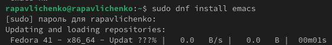
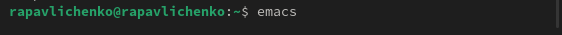
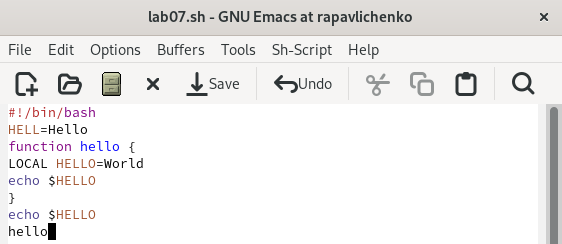
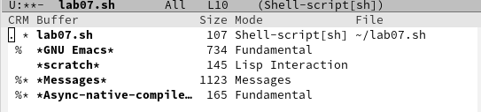
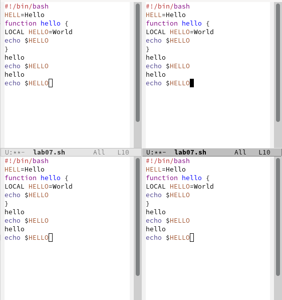
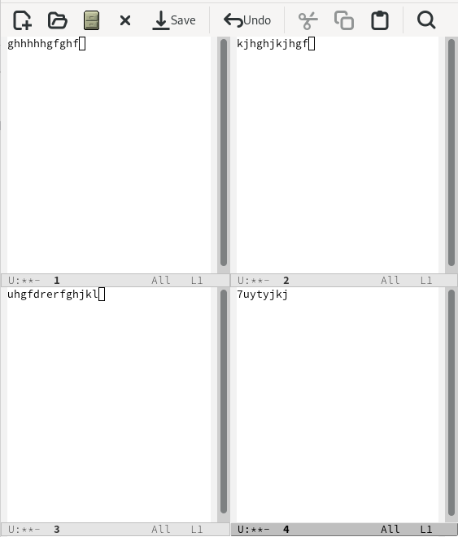
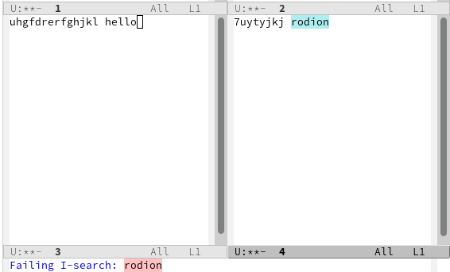
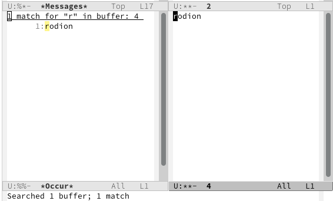

---
## Front matter
title: "Лабораторная работа № 11"
subtitle: "Текстовой редактор emacs"
author: "Павличенко Родион Андреевич"

## Generic otions
lang: ru-RU
toc-title: "Содержание"

## Bibliography
bibliography: bib/cite.bib
csl: pandoc/csl/gost-r-7-0-5-2008-numeric.csl

## Pdf output format
toc: true # Table of contents
toc-depth: 2
lof: true # List of figures
lot: true # List of tables
fontsize: 12pt
linestretch: 1.5
papersize: a4
documentclass: scrreprt
## I18n polyglossia
polyglossia-lang:
  name: russian
  options:
	- spelling=modern
	- babelshorthands=true
polyglossia-otherlangs:
  name: english
## I18n babel
babel-lang: russian
babel-otherlangs: english
## Fonts
mainfont: IBM Plex Serif
romanfont: IBM Plex Serif
sansfont: IBM Plex Sans
monofont: IBM Plex Mono
mathfont: STIX Two Math
mainfontoptions: Ligatures=Common,Ligatures=TeX,Scale=0.94
romanfontoptions: Ligatures=Common,Ligatures=TeX,Scale=0.94
sansfontoptions: Ligatures=Common,Ligatures=TeX,Scale=MatchLowercase,Scale=0.94
monofontoptions: Scale=MatchLowercase,Scale=0.94,FakeStretch=0.9
mathfontoptions:
## Biblatex
biblatex: true
biblio-style: "gost-numeric"
biblatexoptions:
  - parentracker=true
  - backend=biber
  - hyperref=auto
  - language=auto
  - autolang=other*
  - citestyle=gost-numeric
## Pandoc-crossref LaTeX customization
figureTitle: "Рис."
tableTitle: "Таблица"
listingTitle: "Листинг"
lofTitle: "Список иллюстраций"
lotTitle: "Список таблиц"
lolTitle: "Листинги"
## Misc options
indent: true
header-includes:
  - \usepackage{indentfirst}
  - \usepackage{float} # keep figures where there are in the text
  - \floatplacement{figure}{H} # keep figures where there are in the text
---

# Цель работы

Познакомиться с операционной системой Linux. Получить практические навыки работы с редактором Emacs.

# Выполнение лабораторной работы

Устанавливаем emacs

{#fig:001 width=70%}

Открываем emacs

{#fig:002 width=70%}

Создаем файл lab07.sh

{#fig:003 width=70%}

Редактируем файл и проделываем необходимые команды

{#fig:004 width=70%}

{#fig:005 width=70%}

Поделили фрейм на 4 части: разделили фрейм на два окна по вертикали (C-x 3), а затем каждое из этих окон на две части по горизонтали (C-x 2)

{#fig:006 width=70%}

Выполнили команды , перешли в режим поиска, нашли несколько слов. 

{#fig:007 width=70%}

{#fig:008 width=70%}

{#fig:009 width=70%}

# Контрольные вопросы

1. Emacs — это мощный расширяемый текстовый редактор, поддерживающий работу с множеством файлов, языков программирования, встроенный терминал, почтовый клиент и даже игры. Он известен своей гибкостью благодаря языку расширений Emacs Lisp.

2. Нетрадиционная система команд с использованием сочетаний клавиш Ctrl и Meta. Сложная навигация по буферам и окнам. Огромное количество функций, требующих времени на изучение. Отсутствие стандартного графического интерфейса в консольной версии.
3. Буфер в Emacs — это область памяти, которая хранит содержимое файла или другие данные (например, результаты команд или справку). Окно — это часть экрана, которая отображает один из буферов.

4. Да, можно открыть более 10 буферов в одном окне, переключаясь между ними с помощью команды выбора буфера.

5. При запуске Emacs создаются как минимум три буфера:
scratch — для временных заметок. Messages — для вывода системных сообщений. Help — если был вызван справочник.

6. Для ввода комбинации C-c | нужно нажать Ctrl + c, а затем |. Для ввода комбинации C-c C-| нужно нажать Ctrl + c, затем Ctrl + |.

7. Чтобы разделить текущее окно на две части, используйте команду C-x 2 для горизонтального разделения и C-x 3 для вертикального.

8. Настройки Emacs хранятся в файле .emacs или `iniinit.el в каталоге ~/.emacs.d/.

9. Клавиша выполняет определённые функции, например, C-x C-s сохраняет файл. Клавиши можно переназначить с помощью команд global-set-key или define-key в Emacs Lisp.

10. Что удобнее — vi или Emacs — зависит от предпочтений пользователя. Vi быстрее в базовом редактировании, так как его модальное управление позволяет выполнять команды без сочетаний клавиш. Emacs же мощнее и гибче, особенно для программистов и системных администраторов, но

# Выводы

Познакомились с операционной системой Linux. Получили практические навыки работы с редактором Emacs.

