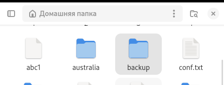
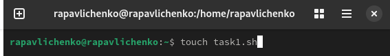
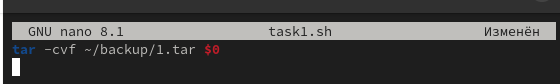
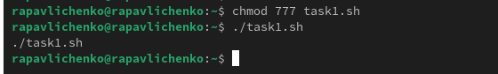
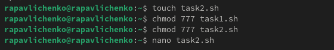
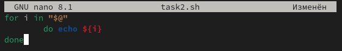
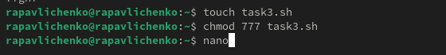
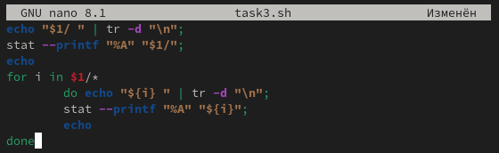
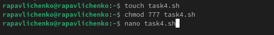
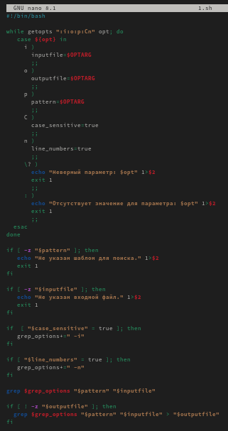

---
## Front matter
lang: ru-RU
title: Лабораторная работа № 12
subtitle: Программирование в командном процессоре ОС UNIX. Командные файлы
author:
  - Павличенко Родион Андреевич
institute:
  - Российский университет дружбы народов, Москва, Россия

## i18n babel
babel-lang: russian
babel-otherlangs: english

## Formatting pdf
toc: false
toc-title: Содержание
slide_level: 2
aspectratio: 169
section-titles: true
theme: metropolis
header-includes:
 - \metroset{progressbar=frametitle,sectionpage=progressbar,numbering=fraction}
---

# Информация

## Докладчик

:::::::::::::: {.columns align=center}
::: {.column width="70%"}

  * Павличенко Родион Андреевич
  * студент
  * Российский университет дружбы народов
  * [1132246838@pfur.ru](mailto:1132246838@pfur.ru)
  
:::
::: {.column width="30%"}

:::
::::::::::::::

# Выполнение лабораторной работы

## Создаем папку backup и файл task1.txt

:::::::::::::: {.columns align=center}
::: {.column width="30%"}

:::
::::::::::::::

## Пишем код в файле

:::::::::::::: {.columns align=center}
::: {.column width="30%"}

:::
::::::::::::::

## Запускаем файл

:::::::::::::: {.columns align=center}
::: {.column width="30%"}

:::
::::::::::::::

## Создаем файл task2.txt и выдаем права

:::::::::::::: {.columns align=center}
::: {.column width="30%"}

:::
::::::::::::::

## Пишем код в файле

:::::::::::::: {.columns align=center}
::: {.column width="30%"}

:::
::::::::::::::

## Создаем файл task3.txt и выдаем права

:::::::::::::: {.columns align=center}
::: {.column width="30%"}

:::
::::::::::::::

## Пишем код в файле

:::::::::::::: {.columns align=center}
::: {.column width="30%"}

:::
::::::::::::::

## Создаем файл task4.txt и выдаем права

:::::::::::::: {.columns align=center}
::: {.column width="30%"}

:::
::::::::::::::

## Пишем код в файле

:::::::::::::: {.columns align=center}
::: {.column width="30%"}

:::
::::::::::::::

## Вывод

Изучили основы программирования в оболочке ОС UNIX/Linux. Научились писать небольшие командные файлы.

