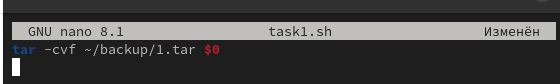

---
## Front matter
title: "Лабораторная работа № 12"
subtitle: "Программирование в командном процессоре ОС UNIX. Командные файлы"
author: "Павличенко Родион Андреевич"

## Generic otions
lang: ru-RU
toc-title: "Содержание"

## Bibliography
bibliography: bib/cite.bib
csl: pandoc/csl/gost-r-7-0-5-2008-numeric.csl

## Pdf output format
toc: true # Table of contents
toc-depth: 2
lof: true # List of figures
lot: true # List of tables
fontsize: 12pt
linestretch: 1.5
papersize: a4
documentclass: scrreprt
## I18n polyglossia
polyglossia-lang:
  name: russian
  options:
	- spelling=modern
	- babelshorthands=true
polyglossia-otherlangs:
  name: english
## I18n babel
babel-lang: russian
babel-otherlangs: english
## Fonts
mainfont: IBM Plex Serif
romanfont: IBM Plex Serif
sansfont: IBM Plex Sans
monofont: IBM Plex Mono
mathfont: STIX Two Math
mainfontoptions: Ligatures=Common,Ligatures=TeX,Scale=0.94
romanfontoptions: Ligatures=Common,Ligatures=TeX,Scale=0.94
sansfontoptions: Ligatures=Common,Ligatures=TeX,Scale=MatchLowercase,Scale=0.94
monofontoptions: Scale=MatchLowercase,Scale=0.94,FakeStretch=0.9
mathfontoptions:
## Biblatex
biblatex: true
biblio-style: "gost-numeric"
biblatexoptions:
  - parentracker=true
  - backend=biber
  - hyperref=auto
  - language=auto
  - autolang=other*
  - citestyle=gost-numeric
## Pandoc-crossref LaTeX customization
figureTitle: "Рис."
tableTitle: "Таблица"
listingTitle: "Листинг"
lofTitle: "Список иллюстраций"
lotTitle: "Список таблиц"
lolTitle: "Листинги"
## Misc options
indent: true
header-includes:
  - \usepackage{indentfirst}
  - \usepackage{float} # keep figures where there are in the text
  - \floatplacement{figure}{H} # keep figures where there are in the text
---

# Цель работы

Изучить основы программирования в оболочке ОС UNIX/Linux. Научиться писать небольшие командные файлы.

# Выполнение лабораторной работы

Создаем папку backup и файл task1.txt

{#fig:001 width=70%}

{#fig:002 width=70%}

Пишем код в файле

{#fig:003 width=70%}

Запускаем файл

{#fig:004 width=70%}

Создаем файл task2.txt и выдаем права

{#fig:005 width=70%}

Пишем код в файле

{#fig:006 width=70%}

Создаем файл task3.txt и выдаем права

{#fig:007 width=70%}

Пишем код в файле

{#fig:008 width=70%}

Создаем файл task4.txt и выдаем права

{#fig:009 width=70%}

Пишем код в файле

{#fig:010 width=70%}

# Контрольные вопросы

1. Командная оболочка — это интерфейс для взаимодействия пользователя с операционной системой с помощью текстовых команд. Она принимает команды, выполняет их и выводит результаты. Примеры командных оболочек: Bash (Bourne Again Shell), Zsh, Csh, Fish. Основное различие заключается в функционале, поддерживаемых функциях и синтаксисе. Например, Bash является наиболее популярной оболочкой в Linux и поддерживает широкие возможности автоматизации и написания сценариев, в то время как Zsh известна своей настраиваемостью и улучшенными функциями автозаполнения.

2. POSIX (Portable Operating System Interface) — это набор стандартов, определяющих интерфейсы операционных систем, которые должны поддерживать совместимость на уровне программного обеспечения. Стандарты POSIX гарантируют, что программы, написанные для одной совместимой операционной системы, будут работать на других совместимых ОС без изменений.

3. Переменные в Bash определяются с помощью оператора присваивания без пробела, например: variable=value. Массивы создаются с помощью индексации: array=(value1 value2 value3) и доступ к элементам массива осуществляется через индексы, например: ${array[0]}.

4. Оператор `let используется для выполнения арифметических операций, например, let "a = 5 + 3". Оператор read используется для ввода данных пользователем в скриптах, например, read variable — считывает строку и с

5. В Bash можно использовать стандартные арифметические операции, такие как сложение (+), вычитание (-), ум*), деление (/), остаток от деления (%), а также инкремент (++) и декремент (--).

6. Операция (( )) в Bash используется для выполнения арифметических операций или проверки условий в числовых выражениях. Например, `((a = b +((a = b + c)) выполняя ((a == b))

7. Некоторые стандартные переменные в Bash включают:

$HOME — домашний каталог пользователя.

$USER — имя текущего пользователя.

$PATH — переменная, содержащая пути к исполнимым файлам.

$PWD — текущий рабочий каталог.

$SHELL — путь к командной оболочке.

8. Метасимволы — это специальные символы, которые имеют особое значение в оболочке. Примеры метасимволов:

*— соответствует любому набору символов.

? — соответствует одному любому символу.

[] — соответствует любому символу из набора.

| — используется для передачи вывода одной команды как ввода для другой.

9. Метасимволы можно экранировать с помощью обратной косой черты (\). Например, чтобы использовать символ * как обычный символ, нужно написать его как \*.

10. Командные файлы создаются с помощью текстового редактора.sh. Чтобы сделать файл исполняемым, нужно использовать команду chmod +x filename.sh. Для запуска файла используется команда ./filename.sh.

11. Функции в Bash определяются следующим образом:

function_name() {

  commands

}

Или

function function_name {

  commands

}
Функция вызывается по имени, как и любая друга

11.  Для этого используется команда test, например:

test -d filename — проверяет, является ли файл каталогом.

test -f filename — проверяет, является ли файл обычным файлом.

12. set — используется для отображения или изменения параметров оболочки и переменных.

typeset — используется для создания и модификации переменных, а также для задания их типа.

unset — удаляет переменную или функцию.

13. Параметры передаются в командные файлы через позиционные параметры, которые доступны как $1, $2, ..., $N. Все параметры можно получить через $@ или $*.

14. Некоторые специальные переменные Bash:

$0 — имя скрипта или команды.

$# — количество переданных параметров.

$@ — все переданные параметры как список.

$? — код завершения последней выполненной команды.

$$ — идентификатор текущего процесса.

# Выводы

Изучили основы программирования в оболочке ОС UNIX/Linux. Научились писать небольшие командные файлы.
