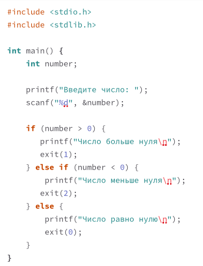
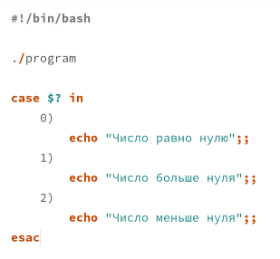
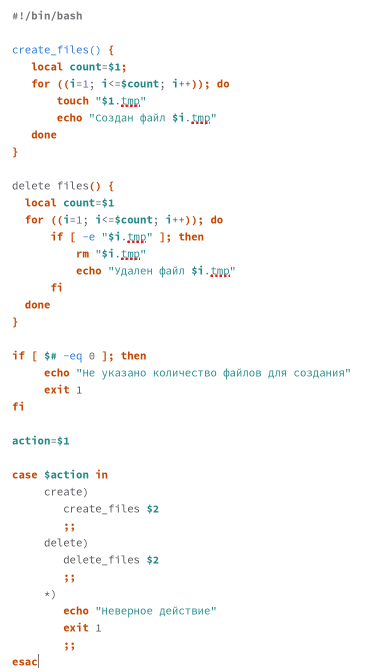
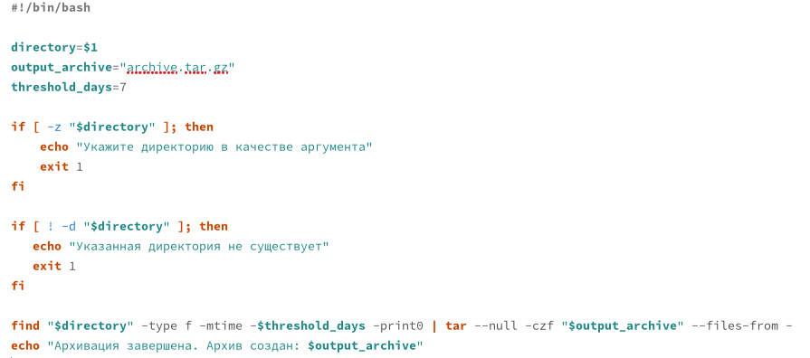

---
## Front matter
lang: ru-RU
title: Лабораторная работа № 13
subtitle: Программирование в командном процессоре ОС UNIX. Ветвления и циклы.
author:
  - Павличенко Родион Андреевич
institute:
  - Российский университет дружбы народов, Москва, Россия

## i18n babel
babel-lang: russian
babel-otherlangs: english

## Formatting pdf
toc: false
toc-title: Содержание
slide_level: 2
aspectratio: 169
section-titles: true
theme: metropolis
header-includes:
 - \metroset{progressbar=frametitle,sectionpage=progressbar,numbering=fraction}
---

# Информация

## Докладчик

:::::::::::::: {.columns align=center}
::: {.column width="70%"}

  * Павличенко Родион Андреевич
  * студент
  * Российский университет дружбы народов
  * [1132246838@pfur.ru](mailto:1132246838@pfur.ru)
  
:::
::: {.column width="30%"}

:::
::::::::::::::

# Выполнение лабораторной работы

## Используя команды getopts grep, написали командный файл, который анализирует командную строку с ключами

:::::::::::::: {.columns align=center}
::: {.column width="30%"}

:::
::::::::::::::

## Написали на языке Си программу, которая вводит число и определяет, является ли оно больше нуля, меньше нуля или равно нулю. Затем программа завершается с помощью функции exit(n), передавая информацию в коде завершения в оболочку. Командный файл должен вызывать эту программу и, проанализировав с помощью команды $?, выдать сообщение о том, какое число было введено.

:::::::::::::: {.columns align=center}
::: {.column width="30%"}

:::
::::::::::::::

## Написали командный файл, создающий указанное число файлов, пронумерованных последовательно от 1 до 𝑁 (например 1.tmp, 2.tmp, 3.tmp,4.tmp и т.д.). Число файлов, которые необходимо создать, передаётся в аргументы командной строки. Этот же командный файл должен уметь удалять все созданные им файлы (если они существуют)

:::::::::::::: {.columns align=center}
::: {.column width="30%"}

:::
::::::::::::::

## Написали командный файл, который с помощью команды tar запаковывает в архив все файлы в указанной директории. Модифицировали его так, чтобы запаковывались только те файлы, которые были изменены менее недели тому назад (использовать команду find).

:::::::::::::: {.columns align=center}
::: {.column width="30%"}

:::
::::::::::::::

## Вывод

Изучили основы программирования в оболочке ОС UNIX. Научились писать более сложные командные файлы с использованием логических управляющих конструкций и циклов

