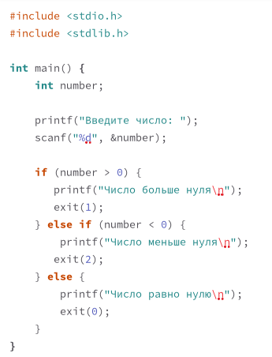
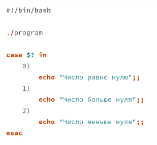
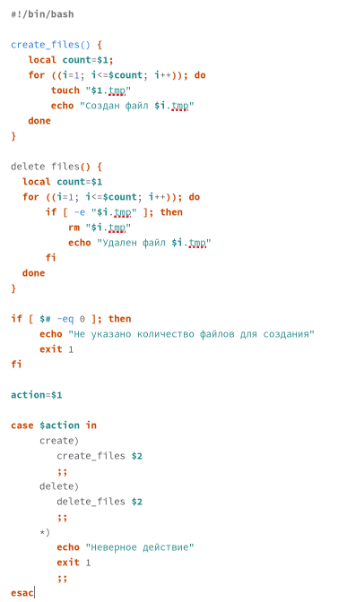
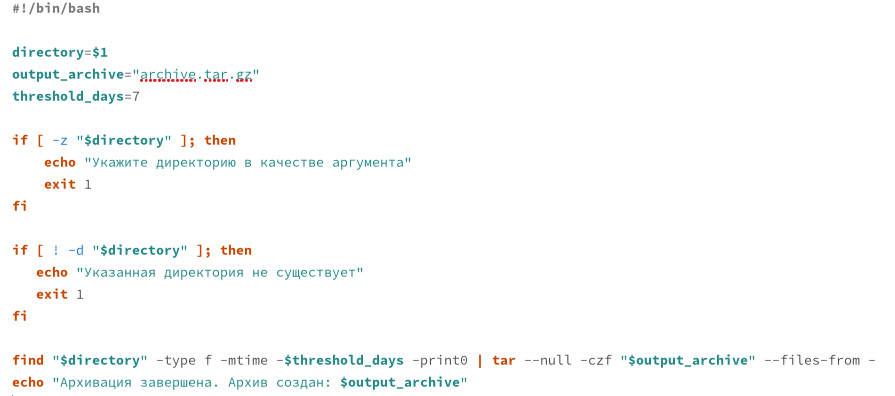

---
## Front matter
title: "Лабораторная работа № 13"
subtitle: "Программирование в командном процессоре ОС UNIX. Ветвления и циклы."
author: "Павличенко Родион Андреевич"

## Generic otions
lang: ru-RU
toc-title: "Содержание"

## Bibliography
bibliography: bib/cite.bib
csl: pandoc/csl/gost-r-7-0-5-2008-numeric.csl

## Pdf output format
toc: true # Table of contents
toc-depth: 2
lof: true # List of figures
lot: true # List of tables
fontsize: 12pt
linestretch: 1.5
papersize: a4
documentclass: scrreprt
## I18n polyglossia
polyglossia-lang:
  name: russian
  options:
	- spelling=modern
	- babelshorthands=true
polyglossia-otherlangs:
  name: english
## I18n babel
babel-lang: russian
babel-otherlangs: english
## Fonts
mainfont: IBM Plex Serif
romanfont: IBM Plex Serif
sansfont: IBM Plex Sans
monofont: IBM Plex Mono
mathfont: STIX Two Math
mainfontoptions: Ligatures=Common,Ligatures=TeX,Scale=0.94
romanfontoptions: Ligatures=Common,Ligatures=TeX,Scale=0.94
sansfontoptions: Ligatures=Common,Ligatures=TeX,Scale=MatchLowercase,Scale=0.94
monofontoptions: Scale=MatchLowercase,Scale=0.94,FakeStretch=0.9
mathfontoptions:
## Biblatex
biblatex: true
biblio-style: "gost-numeric"
biblatexoptions:
  - parentracker=true
  - backend=biber
  - hyperref=auto
  - language=auto
  - autolang=other*
  - citestyle=gost-numeric
## Pandoc-crossref LaTeX customization
figureTitle: "Рис."
tableTitle: "Таблица"
listingTitle: "Листинг"
lofTitle: "Список иллюстраций"
lotTitle: "Список таблиц"
lolTitle: "Листинги"
## Misc options
indent: true
header-includes:
  - \usepackage{indentfirst}
  - \usepackage{float} # keep figures where there are in the text
  - \floatplacement{figure}{H} # keep figures where there are in the text
---

# Цель работы

Изучить основы программирования в оболочке ОС UNIX. Научиться писать более сложные командные файлы с использованием логических управляющих конструкций и циклов.

# Выполнение лабораторной работы

Используя команды getopts grep, написали командный файл, который анализирует командную строку с ключами

{#fig:001 width=70%}

Написали на языке Си программу, которая вводит число и определяет, является ли оно больше нуля, меньше нуля или равно нулю. Затем программа завершается с помощью функции exit(n), передавая информацию в коде завершения в оболочку. Командный файл должен вызывать эту программу и, проанализировав с помощью команды $?, выдать сообщение о том, какое число было введено.

{#fig:002 width=70%}

Написали командный файл, создающий указанное число файлов, пронумерованных последовательно от 1 до 𝑁 (например 1.tmp, 2.tmp, 3.tmp,4.tmp и т.д.). Число файлов, которые необходимо создать, передаётся в аргументы командной строки. Этот же командный файл должен уметь удалять все созданные им файлы (если они существуют)

{#fig:003 width=70%}

Написали командный файл, который с помощью команды tar запаковывает в архив все файлы в указанной директории. Модифицировали его так, чтобы запаковывались только те файлы, которые были изменены менее недели тому назад (использовать команду find).

{#fig:004 width=70%}

# Контрольные вопросы

1. Команда getopts используется для обработки аргументов командной строки в скриптах. Она позволяет анализировать переданные опции (флаги) и их аргументы, упрощая работу с командной строкой. 

2. Метасимволы, такие как *, ?, и [], используются для создания списка файлов, соответствующих шаблону. Это называется расширением (глоббингом). Например, *.txt будет соответствовать всем файлам с расширением .txt в текущем каталоге, а file[1-9].txt — файлам с именами, такими как file1.txt, file2.txt и так далее.

3. Операторы управления действиями в Bash включают:

&& — логическое И, выполняет команду только если предыдущая завершилась успешно.

|| — логическое ИЛИ, выполняет команду только если предыдущая завершилас

; — разделяет команды, выполняются последовательно.

() — позволяет выполнить команды в подshell.

{} — позволяет выполнять команды в текущем процессе.

4. Для прерывания цикла в Bash используются:

break — немедленно завершает выполнение цикла.

continue — пропускает текущую итерацию цикла и переходит к следующей.

5. Команды true и false всегда возвращают статус выхода 0 и 1 соответственно. Это полезно для создания условий или управления потоком в скриптах. Например, false можно использовать для того, чтобы всегда завершать выполнение команды с ошибкой, а true — для успешного завершения.

6. Строка if test -f man$s/$i.$s проверяет, существует ли файл с именем, сформированным из переменных man, $s, $i и $s. В частности:

test -f проверяет, является ли файл обычным файлом.

$i и $s — это переменные, которые подставляются в строку для формирования

7. while выполняет блок команд, пока условие истинно.
until выполняет блок команд, пока условие ложно.

# Выводы

Изучили основы программирования в оболочке ОС UNIX. Научились писать более сложные командные файлы с использованием логических управляющих конструкций и циклов

