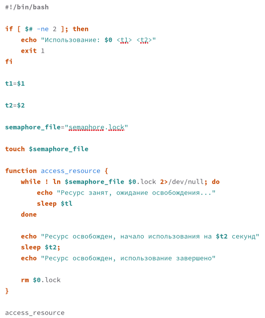
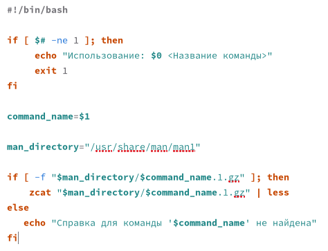
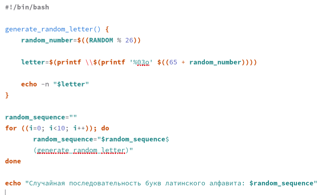

---
## Front matter
title: "Лабораторная работа № 14"
subtitle: "Программирование в командном процессоре ОС UNIX. Расширенное программирование"
author: "Павличенко Родион Андреевич"

## Generic otions
lang: ru-RU
toc-title: "Содержание"

## Bibliography
bibliography: bib/cite.bib
csl: pandoc/csl/gost-r-7-0-5-2008-numeric.csl

## Pdf output format
toc: true # Table of contents
toc-depth: 2
lof: true # List of figures
lot: true # List of tables
fontsize: 12pt
linestretch: 1.5
papersize: a4
documentclass: scrreprt
## I18n polyglossia
polyglossia-lang:
  name: russian
  options:
	- spelling=modern
	- babelshorthands=true
polyglossia-otherlangs:
  name: english
## I18n babel
babel-lang: russian
babel-otherlangs: english
## Fonts
mainfont: IBM Plex Serif
romanfont: IBM Plex Serif
sansfont: IBM Plex Sans
monofont: IBM Plex Mono
mathfont: STIX Two Math
mainfontoptions: Ligatures=Common,Ligatures=TeX,Scale=0.94
romanfontoptions: Ligatures=Common,Ligatures=TeX,Scale=0.94
sansfontoptions: Ligatures=Common,Ligatures=TeX,Scale=MatchLowercase,Scale=0.94
monofontoptions: Scale=MatchLowercase,Scale=0.94,FakeStretch=0.9
mathfontoptions:
## Biblatex
biblatex: true
biblio-style: "gost-numeric"
biblatexoptions:
  - parentracker=true
  - backend=biber
  - hyperref=auto
  - language=auto
  - autolang=other*
  - citestyle=gost-numeric
## Pandoc-crossref LaTeX customization
figureTitle: "Рис."
tableTitle: "Таблица"
listingTitle: "Листинг"
lofTitle: "Список иллюстраций"
lotTitle: "Список таблиц"
lolTitle: "Листинги"
## Misc options
indent: true
header-includes:
  - \usepackage{indentfirst}
  - \usepackage{float} # keep figures where there are in the text
  - \floatplacement{figure}{H} # keep figures where there are in the text
---

# Цель работы

Изучить основы программирования в оболочке ОС UNIX. Научиться писать более сложные командные файлы с использованием логических управляющих конструкций и циклов.

# Выполнение лабораторной работы

Написали командный файл, реализующий упрощённый механизм семафоров. Командный файл должен в течение некоторого времени t1 дожидаться освобождения ресурса, выдавая об этом сообщение, а дождавшись его освобождения, использовать его в течение некоторого времени t2<>t1, также выдавая информацию о том, что ресурс используется соответствующим командным файлом (процессом). Запустили командный файл в одном виртуальном терминале в фоновом режиме, перенаправив его вывод в другой (> /dev/tty#, где # — номер терминала куда перенаправляется вывод), в котором также запущен этот файл, но не фоновом, а в привилегированном режиме. Доработали программу так, чтобы имелась возможность взаимодействия трёх и более процессов.

{#fig:001 width=70%}

Реализовали команду man с помощью командного файла. Изучили содержимое каталога /usr/share/man/man1. В нем находятся архивы текстовых файлов, содержащих справку по большинству установленных в системе программ и команд. Каждый архив можно открыть командой less сразу же просмотрев содержимое справки. Командный файл должен получать в виде аргумента командной строки название команды и в виде результата выдавать справку об этой команде или сообщение об отсутствии справки, если соответствующего файла нет в каталоге man1.

{#fig:002 width=70%}

Используя встроенную переменную $RANDOM, написали командный файл, генерирующий случайную последовательность букв латинского алфавита. Учли, что $RANDOM выдаёт псевдослучайные числа в диапазоне от 0 до 32767

{#fig:003 width=70%}

# Контрольные вопросы

1 Ошибка: отсутствует пробел между [ и условием. Правильный синтаксис:

while [ "$1" != "exit" ]

В Bash важно ставить пробелы вокруг [ и ]. Также лучше заключать переменные в кавычки, чтобы избежать ошибок при обработке значений с пробелами.

2. Для объединения строк в Bash можно использовать простой подход с помощью оператора конкатенации. Пример:

str1="Hello"
str2="World"
result="$str1 $str2"
echo $result

3.Утилита seq используется для генерации последовательности чисел. Пример использования:

seq 1 5
Результат:

1
2
3
4
5

Альтернативы: Можно реализовать функциональность seq с помощью Bash-цикла:

for i in {1..5}; do
 
 echo $i

done

4. В Bash выражения внутри $(()) выполняются как целочисленные операции. Ожидаемый результат:

Результат: 3. В Bash при целочисленных операциях дробная часть усекается.

5.Основные отличия между zsh и bash:

Автодополнение: Zsh имеет более продвинутую систему автодополнения, включая расширенные возможности автодополнения путей и параметров команд.

Тема и настройка: Zsh предлагает больше возможностей для кастомизации и настройки через темы (например, с помощью oh-my-zsh).

Модальности: Zsh поддерживает дополнительные возможности для работы с массивами и строками.

Поддержка глобальных псевдонимов: в Zsh можно использовать глобальные псевдонимы, которые работают в любом контексте, в отличие от Bash, где они ограничены только оболочкой.

6. Синтаксис верен, но нужно убедиться, что переменная LIMIT определена. 

LIMIT=10

for ((a=1; a <= LIMIT; a++)); do
  
  echo $a

done

7. Преимущества Bash:

Интеграция с ОС: Bash тесно интегрирован с операционной системой, что делает его удобным для работы с файловой системой, процессами и системными командами.

Простота и скорость: скрипты на Bash легко пишутся и быстро выполняются, идеально подходят для автоматизации системных задач.

Низкоуровневая работа с процессами: Bash позволяет запускать процессы, считывать их вывод и управлять ими, что обеспечивает полную гибкость в управлении.

Недостатки Bash:

Ограниченные возможности для сложных программ: Bash не подходит для написания крупных приложений, поскольку это не полноценный язык программирования, а скорее оболочка для скриптов.

Отсутствие объектно-ориентированного подхода: в Bash отсутствуют классы и объекты, что затрудняет организацию сложных программных решений.

Ошибки при работе с переменными: управление типами данных в Bash ограничено

# Выводы

Изучили основы программирования в оболочке ОС UNIX. Научились писать более сложные командные файлы с использованием логических управляющих конструкций и циклов.

